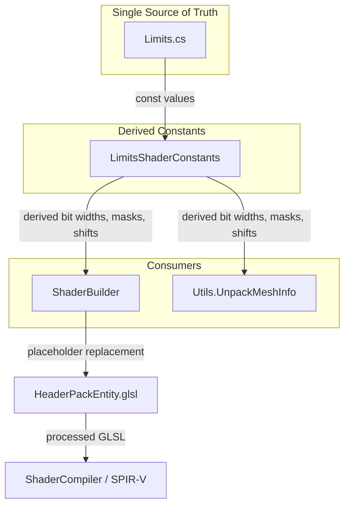

# Design Document: Limits-Shader-Sync

## Overview

This feature eliminates hardcoded bit-packing magic numbers from both GLSL shaders and C# unpacking code by deriving all masks, bit widths, and shift amounts from the single source of truth: `Limits.cs`. The `ShaderBuilder` gains a placeholder replacement pass that injects computed constants into GLSL source before include resolution and compilation. On the C# side, `Utils.UnpackMeshInfo` is refactored to reference `Limits` constants and derived values directly.

The core problem is a synchronization hazard: if someone changes a limit value (e.g., `MaxEntityId` from 16 bits to 20 bits), they must manually update hex literals in three separate locations (Limits.cs, HeaderPackEntity.glsl, Utils.cs). This feature makes that propagation automatic.

### Key Design Decisions

1. **Derived constants live in `Limits.cs` as static readonly properties** — computed from the existing `const` fields using `System.Numerics.BitOperations.Log2`. This keeps all bit-packing knowledge in one place and avoids a separate helper class.

2. **Placeholder replacement happens in `ShaderBuilder.ProcessShader`** — as a text substitution pass before include resolution. This means placeholders work in both user shader source and `#include`d headers.

3. **Placeholders use a `LIMITS_` prefix convention** — e.g., `LIMITS_MAX_WORLD_ID_MASK`, `LIMITS_ENTITY_ID_SHIFT`. This makes them visually distinct from GLSL defines and easy to detect for unrecognized-token warnings.

4. **No GLSL `#define` injection** — placeholders are replaced inline in the source text rather than emitted as `#define` directives. This avoids polluting the preprocessor namespace and keeps the GLSL readable after replacement.

## Architecture



**Data flow:**
1. `Limits.cs` defines max-value constants (`MaxWorldId`, `MaxEntityId`, `MaxInstanceCount`, `MaxIndexCount`).
2. A new static class `LimitsShaderConstants` (in the `HelixTookit.Nex` foundation project, alongside `Limits.cs`) computes derived values: bit widths, masks, and shift amounts.
3. `ShaderBuilder` reads the placeholder dictionary from `LimitsShaderConstants` and performs text replacement during `ProcessShader`.
4. `Utils.UnpackMeshInfo` references `LimitsShaderConstants` for masks and shifts instead of hardcoded literals.

## Components and Interfaces

### 1. LimitsShaderConstants (New)

**Location:** `Source/HelixToolkit-Nex/HelixTookit.Nex/LimitsShaderConstants.cs`  
**Namespace:** `HelixToolkit.Nex`

This static class derives all bit-packing constants from `Limits` values. It uses `System.Numerics.BitOperations.Log2` to compute bit widths from max values.

```csharp
public static class LimitsShaderConstants
{
    // Bit widths (derived from max values)
    public static readonly int WorldIdBits;      // Log2(MaxWorldId + 1) = 4
    public static readonly int EntityIdBits;     // Log2(MaxEntityId + 1) = 16
    public static readonly int InstanceCountBits; // Log2(MaxInstanceCount + 1) = 22
    public static readonly int IndexCountBits;   // Log2(MaxIndexCount + 1) = 22

    // X channel layout
    public static readonly int InstanceLowBits;  // 32 - WorldIdBits - EntityIdBits = 12
    
    // Y channel layout
    public static readonly int InstanceHighBits; // InstanceCountBits - InstanceLowBits = 10

    // Shift amounts
    public static readonly int EntityIdShift;        // WorldIdBits = 4
    public static readonly int InstanceLowShift;     // WorldIdBits + EntityIdBits = 20
    public static readonly int InstanceHighShift;    // 0 (lowest bits of Y)
    public static readonly int PrimitiveIdShift;     // InstanceHighBits = 10

    // Masks (as uint)
    public static readonly uint WorldIdMask;         // MaxWorldId (0xF)
    public static readonly uint EntityIdMask;        // MaxEntityId (0xFFFF)
    public static readonly uint InstanceLowMask;     // (1 << InstanceLowBits) - 1 (0xFFF)
    public static readonly uint InstanceHighMask;    // (1 << InstanceHighBits) - 1 (0x3FF)
    public static readonly uint InstanceCountMask;   // MaxInstanceCount (0x3FFFFF)
    public static readonly uint IndexCountMask;      // MaxIndexCount (0x3FFFFF)

    // Placeholder dictionary for ShaderBuilder
    public static IReadOnlyDictionary<string, string> GetGlslPlaceholders();
}
```

The `GetGlslPlaceholders()` method returns a dictionary mapping placeholder tokens to their GLSL-formatted values (with `u` suffix for unsigned literals). Example entries:

| Placeholder                  | Value       |
| ---------------------------- | ----------- |
| `LIMITS_WORLD_ID_MASK`       | `0xFu`      |
| `LIMITS_ENTITY_ID_MASK`      | `0xFFFFu`   |
| `LIMITS_INSTANCE_LOW_MASK`   | `0xFFFu`    |
| `LIMITS_INSTANCE_HIGH_MASK`  | `0x3FFu`    |
| `LIMITS_INSTANCE_COUNT_MASK` | `0x3FFFFFu` |
| `LIMITS_INDEX_COUNT_MASK`    | `0x3FFFFFu` |
| `LIMITS_ENTITY_ID_SHIFT`     | `4u`        |
| `LIMITS_INSTANCE_LOW_SHIFT`  | `20u`       |
| `LIMITS_INSTANCE_LOW_BITS`   | `12u`       |
| `LIMITS_INSTANCE_HIGH_SHIFT` | `10u`       |

### 2. ShaderBuilder Modifications

**Location:** `Source/HelixToolkit-Nex/HelixToolkit.Nex.Shaders/ShaderBuilder.cs`

The `ProcessShader` method gains a placeholder replacement step that runs on the source text before include processing. This ensures placeholders in both inline code and `#include`d files get replaced.

```csharp
// New method in ShaderBuilder
private string ReplaceLimitsPlaceholders(string source)
{
    var placeholders = LimitsShaderConstants.GetGlslPlaceholders();
    foreach (var (token, value) in placeholders)
    {
        source = source.Replace(token, value);
    }
    // Warn about unrecognized LIMITS_ tokens
    WarnUnrecognizedPlaceholders(source);
    return source;
}
```

**Integration point:** Called in `ProcessShader` after version directive extraction but before `ProcessIncludes`. The replacement also runs on include content inside `ProcessIncludes` to handle placeholders in header files.

**Unrecognized token detection:** A regex scan for `LIMITS_[A-Z_]+` tokens remaining after replacement. Any matches are logged as warnings via the existing `_warnings` list.

### 3. HeaderPackEntity.glsl Modifications

**Location:** `Source/HelixToolkit-Nex/HelixToolkit.Nex.Shaders/HxHeaders/HeaderPackEntity.glsl`

All hardcoded hex literals and shift amounts are replaced with placeholder tokens:

```glsl
uvec2 packObjectInfo(uint worldId, uint entityId, uint instanceIndex) {
    if (entityId == 0) {
        return uvec2(0);
    }
    uint x = (worldId & LIMITS_WORLD_ID_MASK) | 
             ((entityId & LIMITS_ENTITY_ID_MASK) << LIMITS_ENTITY_ID_SHIFT) | 
             ((instanceIndex & LIMITS_INSTANCE_LOW_MASK) << LIMITS_INSTANCE_LOW_SHIFT);

    uint y = ((instanceIndex >> LIMITS_INSTANCE_LOW_BITS) & LIMITS_INSTANCE_HIGH_MASK);

    return uvec2(x, y);
}

vec2 packPrimitiveId(in uvec2 objectInfo, in uint primId) {
    uint y = objectInfo.y | ((primId & LIMITS_INDEX_COUNT_MASK) << LIMITS_INSTANCE_HIGH_SHIFT);
    return vec2(uintBitsToFloat(objectInfo.x), uintBitsToFloat(y));
}
```

### 4. Utils.UnpackMeshInfo Modifications

**Location:** `Source/HelixToolkit-Nex/HelixToolkit.Nex.Engine/Utils.cs`

All hardcoded masks and shifts are replaced with references to `LimitsShaderConstants`:

```csharp
public static void UnpackMeshInfo(
    uint r, uint g,
    out uint worldId, out uint entityId,
    out uint instanceId, out uint primitiveId)
{
    worldId = r & LimitsShaderConstants.WorldIdMask;
    entityId = (r >> LimitsShaderConstants.EntityIdShift) & LimitsShaderConstants.EntityIdMask;

    uint instLow = (r >> LimitsShaderConstants.InstanceLowShift);
    uint instHigh = (g & LimitsShaderConstants.InstanceHighMask);
    instanceId = instLow | (instHigh << LimitsShaderConstants.InstanceLowBits);

    primitiveId = (g >> LimitsShaderConstants.PrimitiveIdShift);
}
```

## Data Models

### Bit Layout (unchanged)

The packed entity info uses two 32-bit unsigned integers (uvec2 in GLSL, two `uint` values in C#):

```
X channel (32 bits):
┌──────────────────────┬──────────────────────────────┬────────────┐
│ instanceIndex low    │ entityId                     │ worldId    │
│ bits [20-31] (12b)   │ bits [4-19] (16b)            │ bits [0-3] │
└──────────────────────┴──────────────────────────────┴────────────┘

Y channel (32 bits):
┌──────────────────────────────────────────┬───────────────────────┐
│ primitiveId                              │ instanceIndex high    │
│ bits [10-31] (22b)                       │ bits [0-9] (10b)      │
└──────────────────────────────────────────┴───────────────────────┘
```

### Derived Constants Relationships

All derived values flow from the four `Limits` constants:

```
MaxWorldId (0xF)         → WorldIdBits = 4
MaxEntityId (0xFFFF)     → EntityIdBits = 16
MaxInstanceCount (0x3FFFFF) → InstanceCountBits = 22
MaxIndexCount (0x3FFFFF)    → IndexCountBits = 22

WorldIdBits + EntityIdBits + InstanceLowBits = 32  (X channel constraint)
InstanceLowBits + InstanceHighBits = InstanceCountBits  (instance split constraint)
InstanceHighBits + IndexCountBits = 32  (Y channel constraint, since IndexCountBits = PrimitiveIdBits)

EntityIdShift = WorldIdBits
InstanceLowShift = WorldIdBits + EntityIdBits
PrimitiveIdShift = InstanceHighBits
```

### Placeholder Token Naming Convention

All placeholders follow the pattern `LIMITS_<DESCRIPTIVE_NAME>` where the name uses UPPER_SNAKE_CASE. The `LIMITS_` prefix is reserved for this feature and must not be used for other shader defines.

## Correctness Properties

*A property is a characteristic or behavior that should hold true across all valid executions of a system — essentially, a formal statement about what the system should do. Properties serve as the bridge between human-readable specifications and machine-verifiable correctness guarantees.*

### Property 1: Bit width derivation correctness

*For any* unsigned integer max value of the form `(1 << n) - 1` where `1 <= n <= 31`, computing the bit width via `BitOperations.Log2(maxValue + 1)` SHALL return exactly `n`.

**Validates: Requirements 1.1**

### Property 2: Bit layout channel invariants

*For any* set of derived constants produced by `LimitsShaderConstants` from the current `Limits` values, the following invariants SHALL hold: `WorldIdBits + EntityIdBits + InstanceLowBits == 32` (X channel fills exactly 32 bits), `InstanceLowBits + InstanceHighBits == InstanceCountBits` (instance index split is exact), and `InstanceHighBits + IndexCountBits == 32` (Y channel fills exactly 32 bits).

**Validates: Requirements 1.3**

### Property 3: Placeholder replacement completeness

*For any* GLSL source string containing one or more known `LIMITS_` placeholder tokens at arbitrary positions, after `ShaderBuilder` placeholder replacement, the output SHALL contain zero occurrences of any known placeholder token and SHALL contain the corresponding derived numeric values in their place.

**Validates: Requirements 2.1**

### Property 4: Unrecognized placeholder warning

*For any* GLSL source string containing a token matching the pattern `LIMITS_[A-Z_]+` that is NOT in the set of recognized placeholder tokens, the `ShaderBuilder` SHALL produce a warning identifying that unrecognized token.

**Validates: Requirements 2.3**

### Property 5: Backward compatibility — no placeholders means identical output

*For any* GLSL source string that does not contain any `LIMITS_` tokens, the `ShaderBuilder` output with placeholder replacement enabled SHALL be identical to the output without placeholder replacement.

**Validates: Requirements 2.4, 6.1**

### Property 6: Pack-then-unpack round trip

*For any* valid combination of `worldId` (0 to `MaxWorldId`), `entityId` (0 to `MaxEntityId`), `instanceIndex` (0 to `MaxInstanceCount`), and `primitiveId` (0 to `MaxIndexCount`), packing via the C# equivalent of the GLSL `packObjectInfo` + `packPrimitiveId` logic and then unpacking via `UnpackMeshInfo` SHALL return the original four values.

**Validates: Requirements 4.4, 5.1**

## Error Handling

### Unrecognized Placeholder Tokens

When the `ShaderBuilder` encounters a token matching `LIMITS_[A-Z_]+` that is not in the known placeholder dictionary, it adds a warning to the `ShaderBuildResult.Warnings` list. The warning includes the unrecognized token name and its position context. The build continues successfully — unrecognized tokens are not treated as errors since they may be user-defined constants that happen to start with `LIMITS_`.

### Invalid Limits Values

The `LimitsShaderConstants` static constructor validates that each `Limits` constant is of the form `(1 << n) - 1` (i.e., all lower bits set). If a constant does not satisfy this constraint, the constructor throws an `InvalidOperationException` with a descriptive message. This is a fail-fast approach since invalid limits would produce incorrect bit packing at runtime.

The constructor also validates the 32-bit channel constraints:
- `WorldIdBits + EntityIdBits + InstanceLowBits == 32`
- `InstanceHighBits + IndexCountBits == 32`

If either constraint is violated (e.g., someone sets limits that don't fit in 32 bits per channel), the constructor throws with a message explaining which channel overflows.

### ShaderBuilder Backward Compatibility

If the placeholder replacement pass encounters no `LIMITS_` tokens, it returns the source unchanged with zero overhead beyond the string scan. The existing error handling for `#include` resolution, version directives, and comment stripping is unmodified.

## Testing Strategy

### Property-Based Tests (FsCheck)

The project already uses **FsCheck 3.3.2** with MSTest for property-based testing. Each property test runs a minimum of 100 iterations.

| Property                            | Test Class                             | What It Validates                                                          |
| ----------------------------------- | -------------------------------------- | -------------------------------------------------------------------------- |
| Property 1: Bit width derivation    | `BitWidthDerivationPropertyTests`      | `BitOperations.Log2` correctly computes bit width for all valid max values |
| Property 2: Channel invariants      | `BitLayoutInvariantsPropertyTests`     | Derived constants satisfy 32-bit channel constraints                       |
| Property 3: Placeholder replacement | `PlaceholderReplacementPropertyTests`  | All known placeholders are replaced with correct values                    |
| Property 4: Unrecognized warning    | `UnrecognizedPlaceholderPropertyTests` | Fake LIMITS_ tokens produce warnings                                       |
| Property 5: Backward compatibility  | `BackwardCompatibilityPropertyTests`   | Source without placeholders produces identical output                      |
| Property 6: Round trip              | `PackUnpackRoundTripPropertyTests`     | Pack then unpack returns original values for all valid inputs              |

**Configuration:**
- Library: FsCheck 3.3.2 (already in use)
- Test framework: MSTest (matching existing Shaders.Tests project)
- Iterations: 100 per property (`Config.Default.WithMaxTest(100)`)
- Tag format: `Feature: limits-shader-sync, Property {N}: {title}`

### Unit Tests (Example-Based)

| Test                                          | What It Validates                                                     |
| --------------------------------------------- | --------------------------------------------------------------------- |
| Placeholder dictionary completeness           | All 10+ required placeholder keys exist (Req 2.2)                     |
| HeaderPackEntity has no hardcoded masks       | File content contains LIMITS_ tokens, not hex literals (Req 3.1, 3.2) |
| HeaderPackEntity post-replacement equivalence | Processed output matches expected hex values (Req 3.3)                |
| UnpackMeshInfo uses no hardcoded values       | Verify method references LimitsShaderConstants (Req 4.1, 4.2)         |
| Existing ShaderBuilder features unchanged     | Include resolution, defines, version, comments still work (Req 6.2)   |

### Test Project Location

New property tests and unit tests will be added to the existing `HelixToolkit.Nex.Shaders.Tests` project, with FsCheck added as a dependency. The round-trip test (Property 6) may also live here since it tests the interaction between the Shaders and Engine projects, or in a new shared test project if dependency constraints require it.

