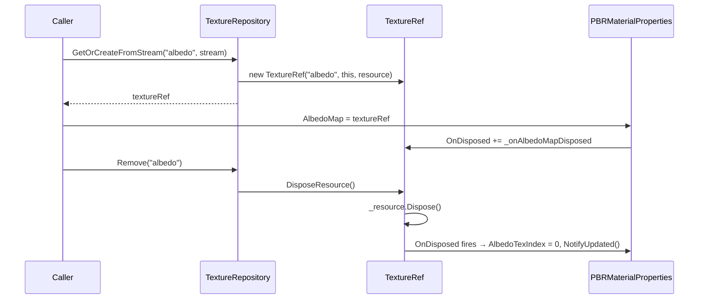

# Design Document: resource-ref-lifecycle

## Overview

This feature redesigns the resource-ref lifecycle for `TextureRef` and `SamplerRef` in HelixToolkit Nex. The current design stores a cached `Handle<T>` in the ref and lazily re-fetches it from the repository via `TryGet` when the handle becomes stale. The new design eliminates the stale-handle problem entirely by embedding the live `TextureResource` / `SamplerResource` directly inside the ref, adds a push-notification `OnDisposed` event so that `PBRMaterialProperties` can zero its bindless indices automatically when a texture or sampler is removed, removes the `Replace*` family of methods in favour of an explicit Remove-then-GetOrCreate pattern, adds async texture creation methods to `ITextureRepository`, and simplifies `EventBus` by removing its background-thread dispatch machinery.

### Goals

- `TextureRef.GetHandle()` and `SamplerRef.GetHandle()` are always O(1) with no repository round-trip.
- Consumers are notified synchronously when a resource is disposed, enabling automatic GPU index zeroing.
- The API surface is simpler: no `Replace*` methods, no async `EventBus`, no `dispatchOnMainThread` parameter.
- Async texture upload is supported without blocking the main thread.

### Non-Goals

- This feature does not change the Vulkan backend, shader system, or ECS.
- This feature does not add reference counting to `TextureRef` or `SamplerRef` — the repository remains the sole owner.
- Thread safety beyond the existing repository-level lock is not added to `TextureRef`, `SamplerRef`, or `PBRMaterialProperties`.

---

## Architecture

The redesign touches five layers, each with a clear dependency direction:

```
EventBus (foundation)
    ↑
TextureRef / SamplerRef  (repository layer)
    ↑
TextureCacheEntry / SamplerModuleCacheEntry  (repository layer)
    ↑
TextureRepository / SamplerRepository  (repository layer)
    ↑
PBRMaterialProperties  (material layer)
    ↑
Callers (samples, rendering nodes)
```

The key architectural shift is that `TextureRef` and `SamplerRef` change from *lazy-fetch wrappers* to *live-resource holders*. The repository creates the ref, stores it in the cache entry, and hands the same object reference back on every cache hit. When the repository disposes an entry it calls `ref.DisposeResource()`, which disposes the embedded resource and fires `OnDisposed` synchronously — allowing `PBRMaterialProperties` to zero its bindless indices before the next frame.



---

## Components and Interfaces

### TextureRef (redesigned)

`TextureRef` changes from a lazy-fetch wrapper to a live-resource holder. The `_cachedHandle` field and the `TryGet` re-fetch logic are removed. The embedded `TextureResource` is set at construction time by the repository and never changes.

```csharp
public sealed class TextureRef
{
    internal TextureResource _resource;           // held internally, set by repository
    public string Key { get; }
    public ITextureRepository Repository { get; }
    public event Action? OnDisposed;

    // Constructor used by repository
    internal TextureRef(string key, ITextureRepository repository, TextureResource resource)

    // Always returns _resource.Handle — no TryGet, no stale-handle check
    public Handle<Texture> GetHandle() => _resource.Handle;

    // Called by repository's DisposeEntry only
    internal void DisposeResource()
    {
        _resource.Dispose();
        OnDisposed?.Invoke();
    }

    public static readonly TextureRef Null = new(string.Empty, NullTextureRepository.Instance, TextureResource.Null);
}
```

**Key changes from current design:**
- Constructor takes `TextureResource` instead of `Handle<Texture>`.
- `GetHandle()` is a single-line property — no branching, no repository call.
- `DisposeResource()` is `internal` — only the repository calls it.
- `OnDisposed` event added for push notification.
- `NullTextureRepository` no longer needs `TryGet` to return a valid entry for the Null sentinel.

### SamplerRef (same pattern)

`SamplerRef` follows the identical pattern as `TextureRef`:

```csharp
public sealed class SamplerRef
{
    internal SamplerResource _resource;
    public string Key { get; }
    public ISamplerRepository Repository { get; }
    public event Action? OnDisposed;

    internal SamplerRef(string key, ISamplerRepository repository, SamplerResource resource)
    public Handle<Sampler> GetHandle() => _resource.Handle;
    internal void DisposeResource() { _resource.Dispose(); OnDisposed?.Invoke(); }
    public static readonly SamplerRef Null = new(string.Empty, NullSamplerRepository.Instance, SamplerResource.Null);
}
```

### TextureCacheEntry (changed)

`TextureCacheEntry` changes its generic parameter from `TextureResource` to `TextureRef`. The `Texture` convenience property is replaced by `Ref`:

```csharp
public sealed class TextureCacheEntry : CacheEntry<TextureRef>
{
    public TextureRef Ref => Resource;
}
```

`TextureRepository` becomes `Repository<string, TextureCacheEntry, TextureRef>`.

### SamplerModuleCacheEntry (changed)

Same pattern:

```csharp
public sealed class SamplerModuleCacheEntry : CacheEntry<SamplerRef>
{
    public SamplerRef Ref => Resource;
}
```

`SamplerRepository` becomes `Repository<string, SamplerModuleCacheEntry, SamplerRef>`.

### ITextureRepository (changed)

Remove methods: `ReplaceFromStream`, `ReplaceFromFile`, `ReplaceFromImage`.

Add async methods:

```csharp
Task<TextureRef> GetOrCreateFromStreamAsync(string name, Stream stream, string? debugName = null);
Task<TextureRef> GetOrCreateFromFileAsync(string filePath, string? debugName = null);
Task<TextureRef> GetOrCreateFromImageAsync(string name, Image image);
```

Keep unchanged: `GetOrCreateFromStream`, `GetOrCreateFromFile`, `GetOrCreateFromImage`, `Remove`, `TryGet`, `Clear`, `CleanupExpired`, `GetStatistics`, `Count`.

### ISamplerRepository (unchanged)

No async methods needed for samplers. The interface is unchanged except that `TryGet` now returns `SamplerModuleCacheEntry?` whose `Ref` property is a `SamplerRef` (the `Sampler` property is removed).

### TextureRepository (changed)

**`StoreEntry` — simplified:**

```csharp
private TextureRef StoreEntry(string cacheKey, TextureResource texture, string debugName)
{
    var textureRef = new TextureRef(cacheKey, this, texture);
    var entry = new TextureCacheEntry
    {
        Resource = textureRef,
        SourceHash = cacheKey,
        DebugName = debugName,
        AccessCount = 1,
    };
    Set(cacheKey, entry);
    return textureRef;
}
```

No `AddResourceReference` call — the repository owns the resource via the ref.

**`DisposeEntry` — delegates to ref:**

```csharp
protected override void DisposeEntry(TextureCacheEntry entry)
{
    entry.Ref.DisposeResource();
}
```

**`AddResourceReference` — no-op:**

```csharp
protected override void AddResourceReference(TextureRef resource) { }
```

**Cache-hit path — returns canonical ref:**

```csharp
if (TryGet(name, out var cached))
    return cached!.Ref;   // same object reference every time
```

**Async methods:**

The async methods use `TextureCreator.CreateTextureAsync` (which creates the `TextureResource` internally via `context.CreateTexture` and then uploads pixel data asynchronously). The repository needs the `TextureResource` object before the upload completes so it can store the ref in the cache immediately. Looking at `TextureCreator.CreateTextureAsync`, it calls `context.CreateTexture` synchronously to get the handle, then issues async uploads. The repository will call `TextureCreator.CreateTextureAsync` and extract the resource from the handle before awaiting:

```csharp
public async Task<TextureRef> GetOrCreateFromStreamAsync(string name, Stream stream, string? debugName = null)
{
    ArgumentException.ThrowIfNullOrEmpty(name);
    ObjectDisposedException.ThrowIf(_context.IsDisposed, this);

    if (TryGet(name, out var cached))
        return cached!.Ref;   // cache hit — completed task

    // Decode image synchronously (CPU work)
    var image = Image.Load(stream)
        ?? throw new InvalidOperationException("Failed to load image from stream");

    // Create GPU resource synchronously (allocates GPU memory, no pixel upload yet)
    var desc = BuildTextureDescNoData(image);
    _context.CreateTexture(desc, out var texture, debugName ?? name).CheckResult();
    var textureResource = texture;

    // Store in cache immediately so concurrent callers get the same ref
    var textureRef = StoreEntry(name, textureResource, debugName ?? name);

    // Upload pixel data asynchronously
    await UploadImageAsync(textureResource.Handle, image, debugName ?? name);
    image.Dispose();

    return textureRef;
}
```

Because `TextureCreator.CreateTextureAsync` bundles both the `CreateTexture` call and the upload loop, the repository will need to replicate the two-step pattern (create without data, then upload) directly rather than delegating to `TextureCreator.CreateTextureAsync`. The `TextureCreator.BuildTextureDesc` helper is private, so `TextureRepository` will call `TextureCreator.CreateTextureAsync` and use the returned `AsyncUploadHandle<TextureHandle>` — but this means the resource is created inside `TextureCreator` and the repository cannot get the `TextureResource` object. 

**Resolution:** Add an internal overload `TextureCreator.CreateTextureAndGetResourceAsync(IContext, Image, string?) → (TextureResource, AsyncUploadHandle<TextureHandle>)` that returns both the resource and the upload handle. Alternatively, expose the two-step as a public method. The cleanest approach is to add a new `TextureCreator` method:

```csharp
// New method in TextureCreator
public static (TextureResource resource, AsyncUploadHandle<TextureHandle> uploadHandle)
    CreateTextureAsyncWithResource(IContext context, Image image, string? debugName = null)
{
    // Create texture without initial data (synchronous)
    var desc = BuildTextureDesc(image, includeData: false);
    context.CreateTexture(desc, out var texture, debugName).CheckResult();
    var handle = texture.Handle;
    // ... upload loop (same as CreateTextureAsync) ...
    return (texture, lastUploadHandle);
}
```

The repository async methods then use this new overload.

### SamplerRepository (changed)

Same structural changes as `TextureRepository` — `StoreEntry` creates a `SamplerRef` and stores it in `SamplerModuleCacheEntry.Resource`, `DisposeEntry` calls `entry.Ref.DisposeResource()`, `AddResourceReference` becomes a no-op, cache hits return `cached!.Ref`.

The `AddResourceReference` override in the current `SamplerRepository` calls `resource.AddReference()` — this is removed because the repository is the sole owner.

### PBRMaterialProperties (changed)

The key change is adding named delegate fields for each texture/sampler slot so that unsubscription is possible, and wiring up subscribe/unsubscribe in each property setter and in `Dispose()`.

**Named delegate fields (one per slot):**

```csharp
private readonly Action _onAlbedoMapDisposed;
private readonly Action _onNormalMapDisposed;
private readonly Action _onMetallicRoughnessMapDisposed;
private readonly Action _onAoMapDisposed;
private readonly Action _onBumpMapDisposed;
private readonly Action _onDisplaceMapDisposed;
private readonly Action _onSamplerDisposed;
private readonly Action _onDisplaceSamplerDisposed;
```

**Initialized in constructor:**

```csharp
_onAlbedoMapDisposed = () => { if (Valid) { Properties.AlbedoTexIndex = 0; NotifyUpdated(); } };
_onNormalMapDisposed = () => { if (Valid) { Properties.NormalTexIndex = 0; NotifyUpdated(); } };
// ... same for all 8 slots
```

**Property setter pattern (AlbedoMap as example):**

```csharp
public TextureRef AlbedoMap
{
    set
    {
        if (_albedoMap == value) return;
        _albedoMap.OnDisposed -= _onAlbedoMapDisposed;   // unsubscribe old
        _albedoMap = value;
        _albedoMap.OnDisposed += _onAlbedoMapDisposed;   // subscribe new
        Properties.AlbedoTexIndex = value.GetHandle().Index;
        NotifyUpdated();
    }
    get => _albedoMap;
}
```

**Dispose — unsubscribe all:**

```csharp
private void Dispose(bool disposing)
{
    if (!_disposedValue)
    {
        if (disposing)
        {
            // Unsubscribe all OnDisposed handlers before releasing pool entry
            _albedoMap.OnDisposed -= _onAlbedoMapDisposed;
            _normalMap.OnDisposed -= _onNormalMapDisposed;
            _metallicRoughnessMap.OnDisposed -= _onMetallicRoughnessMapDisposed;
            _aoMap.OnDisposed -= _onAoMapDisposed;
            _bumpMap.OnDisposed -= _onBumpMapDisposed;
            _displaceMap.OnDisposed -= _onDisplaceMapDisposed;
            _sampler.OnDisposed -= _onSamplerDisposed;
            _displaceSampler.OnDisposed -= _onDisplaceSamplerDisposed;

            var index = Index;
            _pool?.Destroy(_handle);
            _eventBus.Publish(new MaterialPropsUpdatedEvent(MaterialTypeId, index, MaterialPropertyOp.Destroy));
        }
        _disposedValue = true;
    }
}
```

**Constructor change:** The named delegates must be initialized before the `_pool.Create` call. The `PBRMaterialProperties()` private constructor (used for `Null`) initializes them as no-ops or leaves them as null-safe lambdas.

### EventBus (simplified)

Remove: `_publishThread`, `ProcessEventQueue`, `_eventQueue`, `_cancellationTokenSource`, `_mainThreadContext`, `PublishAsync<TEvent>`, `dispatchOnMainThread` parameter on `Subscribe`.

Keep: `Publish<TEvent>` (synchronous direct dispatch), `Subscribe<TEvent>`, `GetSubscriberCount<TEvent>`, `Dispose`.

`PublishInternal` no longer needs `SynchronizationContext.Post` — it calls handlers directly:

```csharp
private void PublishInternal<TEvent>(TEvent eventData) where TEvent : IEvent
{
    if (!_subscribers.TryGetValue(typeof(TEvent), out var subscribersObj))
        return;

    var subscribers = (SubscriberList<TEvent>)subscribersObj;
    var subscriptionsSnapshot = subscribers.GetSnapshot();

    foreach (var subscription in subscriptionsSnapshot)
    {
        try
        {
            subscription.Handler(eventData);
        }
        catch (Exception ex)
        {
            System.Diagnostics.Debug.WriteLine($"Error in event handler: {ex}");
        }
    }
}
```

`Dispose` no longer needs to join a thread:

```csharp
public void Dispose()
{
    if (_disposed) return;
    _disposed = true;
    _subscribers.Clear();
}
```

`EventSubscription<TEvent>` loses the `DispatchOnMainThread` property.

`SubscriberList<TEvent>` is unchanged.

The `EventBus(bool captureMainThreadContext)` constructor overload is removed or simplified to a no-arg constructor. The `EventBus(SynchronizationContext? context)` overload is also removed.

### NullTextureRepository / NullSamplerRepository (changed)

Both null repositories must be updated to remove `Replace*` methods and add async method stubs that return `Task.FromResult(TextureRef.Null)` / `Task.FromResult(SamplerRef.Null)`.

---

## Data Models

### CacheEntry<TResource> — unchanged

`CacheEntry<TResource>` is generic and unchanged. The only change is that `TextureCacheEntry` and `SamplerModuleCacheEntry` now use `TextureRef` and `SamplerRef` as their `TResource` type parameter respectively. Since `TextureRef` and `SamplerRef` are classes (reference types) and implement `IDisposable` implicitly via `DisposeResource()`, they need to implement `IDisposable` for the `CacheEntry<TResource>` constraint.

**Note:** `CacheEntry<TResource>` requires `TResource : class, IDisposable`. `TextureRef` and `SamplerRef` do not currently implement `IDisposable`. They will need to implement it — `Dispose()` on a ref will call `DisposeResource()`. This is consistent with the repository calling `DisposeEntry` → `entry.Ref.DisposeResource()` via the `IDisposable.Dispose()` path.

Alternatively, the `Repository<TKey, TEntry, TResource>` base class calls `DisposeEntry(entry)` which is overridden in the concrete repository — so the `IDisposable` constraint on `TResource` is only used if the base class calls `resource.Dispose()` directly. Looking at the base class, `DisposeEntry` is abstract and the base class never calls `resource.Dispose()` directly — it always goes through `DisposeEntry`. Therefore, we can change the constraint to `TResource : class` (removing `IDisposable`) or add a minimal `IDisposable` implementation to `TextureRef`/`SamplerRef` that delegates to `DisposeResource()`.

**Decision:** Add `IDisposable` to `TextureRef` and `SamplerRef` where `Dispose()` calls `DisposeResource()`. This satisfies the constraint and is semantically correct — disposing a ref disposes its resource.

### PBRProperties struct — unchanged

The `PBRProperties` struct fields (`AlbedoTexIndex`, `NormalTexIndex`, etc.) are unchanged. The change is only in how `PBRMaterialProperties` writes to them.

### TextureHandle / SamplerHandle — unchanged

These are value types and are unchanged.

---

## Correctness Properties

*A property is a characteristic or behavior that should hold true across all valid executions of a system — essentially, a formal statement about what the system should do. Properties serve as the bridge between human-readable specifications and machine-verifiable correctness guarantees.*

### Property 1: Handle-identity invariant

*For any* `TextureRef` constructed with a valid `TextureResource`, `GetHandle().Index` SHALL equal `_resource.Handle.Index` before and after any number of `GetHandle()` calls, regardless of how many times the method is invoked.

**Validates: Requirements 1.2, 1.7**

### Property 2: Ref identity on cache hit

*For any* cache key `K`, two successive calls to `GetOrCreateFrom*(K, ...)` on the same `TextureRepository` instance SHALL return `object.ReferenceEquals(ref1, ref2) == true`.

**Validates: Requirements 2.2, 2.6**

### Property 3: Index zeroed on dispose for all texture slots

*For any* texture slot in `PBRMaterialProperties` (AlbedoMap, NormalMap, MetallicRoughnessMap, AoMap, BumpMap, DisplaceMap), assigning a valid `TextureRef` and then calling `DisposeResource()` on that ref SHALL result in the corresponding `Properties.xxxTexIndex` being `0`.

**Validates: Requirements 4.6**

### Property 4: Cache-hit returns completed task

*For any* key `K` already present in the `TextureRepository` cache, calling `GetOrCreateFromStreamAsync(K, ...)` SHALL return a `Task<TextureRef>` where `IsCompleted == true` immediately upon return (no async work needed for a cache hit).

**Validates: Requirements 6.4**

---

## Error Handling

### Repository disposal

- All `GetOrCreate*` and async methods check `ObjectDisposedException.ThrowIf(_context.IsDisposed, this)` at entry.
- `Remove`, `Clear`, `CleanupExpired` check `ObjectDisposedException.ThrowIf(_disposed, this)` via the base class.

### Async texture creation failures

- If `Image.Load(stream)` returns null, the async method throws `InvalidOperationException` and the task is faulted.
- If `context.CreateTexture` fails (non-Ok result), `CheckResult()` throws and the task is faulted.
- If the file does not exist, `GetOrCreateFromFileAsync` throws `FileNotFoundException` and the task is faulted.
- The `TextureRef` is only stored in the cache after `StoreEntry` succeeds — a faulted task means no cache entry is created.

### OnDisposed with no subscribers

- `OnDisposed?.Invoke()` uses the null-conditional operator — safe when there are no subscribers.

### Double-dispose of TextureRef

- `_resource.Dispose()` on an already-disposed `TextureResource` is safe (the `Resource<T>` base class uses a `_disposedValue` flag and reference counting). `OnDisposed` fires on every `DisposeResource()` call — callers should not call it more than once, but it will not throw.

### EventBus handler exceptions

- `PublishInternal` wraps each handler invocation in a try/catch, logs via `Debug.WriteLine`, and continues to the next handler. Exceptions are never re-thrown.

### PBRMaterialProperties.Null

- The `Null` sentinel has `Valid == false`. All `OnDisposed` callbacks check `if (Valid)` before writing to `Properties`, so they are safe to fire even on the Null instance.
- The named delegate fields on `Null` are initialized to no-op lambdas in the private constructor.

---

## Testing Strategy

### Unit tests

Unit tests cover specific examples, edge cases, and error conditions. They live in the existing test projects:

- `HelixToolkit.Nex.Repository.Tests` — `TextureRefTests.cs`, `SamplerRefTests.cs`, `TextureRefPropertyTests.cs`, `SamplerRefPropertyTests.cs`
- `HelixToolkit.Nex.Tests` — `EventBusTests.cs`
- `HelixToolkit.Nex.Material.Tests` — `MaterialProperties.cs` (extended)

**Key unit test cases:**

1. `TextureRef.Null.GetHandle()` returns invalid handle.
2. `TextureRef.DisposeResource()` fires `OnDisposed` synchronously.
3. `TextureRef.DisposeResource()` with no subscribers does not throw.
4. `PBRMaterialProperties` — assigning ref A then ref B, disposing ref A does NOT zero the index (unsubscription was effective).
5. `PBRMaterialProperties.Dispose()` — disposing the material then disposing a held ref does not fire callbacks.
6. `EventBus.Publish` — handler is invoked before `Publish` returns.
7. `EventBus.Publish` — exception in first handler does not prevent second handler from running.
8. `TextureRepository.Remove(key)` — fires `OnDisposed` on the previously returned ref.
9. `GetOrCreateFromStreamAsync` with missing file — task is faulted with `FileNotFoundException`.

### Property-based tests

Property-based tests use **FsCheck** (already used in the project, as seen in `TextureRefPropertyTests.cs`). Each property test runs a minimum of 100 iterations.

**Property 1 — Handle-identity invariant:**
Tag: `Feature: resource-ref-lifecycle, Property 1: For any TextureRef, GetHandle().Index == _resource.Handle.Index`

Generate random handle indices (1–10000). Construct a `TextureRef` with a `MockContext`-backed `TextureResource` using that index. Call `GetHandle()` N times (N generated 1–50). Verify the returned index equals the resource's handle index on every call.

**Property 2 — Ref identity on cache hit:**
Tag: `Feature: resource-ref-lifecycle, Property 2: For any cache key K, two successive GetOrCreate calls return the same TextureRef object`

Generate random cache key strings. Call `GetOrCreateFromStream(key, ...)` twice on the same `TextureRepository` (backed by `MockContext`). Verify `ReferenceEquals(ref1, ref2) == true`.

**Property 3 — Index zeroed on dispose for all texture slots:**
Tag: `Feature: resource-ref-lifecycle, Property 3: For any texture slot, disposing the assigned ref zeros the index`

Generate a random texture slot index (0–5 mapping to the 6 texture slots). Assign a valid `TextureRef` to that slot on a `PBRMaterialProperties`. Call `DisposeResource()` on the ref. Verify the corresponding `Properties.xxxTexIndex == 0`.

**Property 4 — Cache-hit returns completed task:**
Tag: `Feature: resource-ref-lifecycle, Property 4: For any key already in cache, GetOrCreateFromStreamAsync returns a completed task`

Generate random cache key strings. Insert the key via `GetOrCreateFromStream`. Call `GetOrCreateFromStreamAsync(key, ...)`. Verify `task.IsCompleted == true` immediately (before any await).

### Tests to update

The following existing tests reference APIs that are being removed or changed and must be updated:

- `TextureRefPropertyTests.cs` — `MockTextureRepository` implements `ReplaceFrom*` methods and the `TryGet` returns `TextureCacheEntry` with a `Resource` field. Both must be updated to the new API.
- `TextureRefPropertyTests.cs` — `Property3_StaleHandle_TriggersReFetch` tests the old lazy-fetch behavior which is removed. This test must be replaced with a test for the new direct-resource behavior.
- `TextureRefPropertyTests.cs` — `Property2_ValidCachedHandle_SkipsRepository` tests that `TryGet` is not called — this remains valid but the mechanism changes (no cached handle, just direct resource access).
- `EventBusTests.cs` — Tests for `PublishAsync`, `dispatchOnMainThread`, `captureMainThreadContext`, and `SynchronizationContext` dispatch must be removed or updated to reflect the simplified synchronous-only API.
- `MaterialProperties.cs` — References `TextureResource.Null` for `AlbedoTexture` — this is on `UnlitMaterialProperties`, not `PBRMaterialProperties`, so it may be unaffected. Verify after changes.
