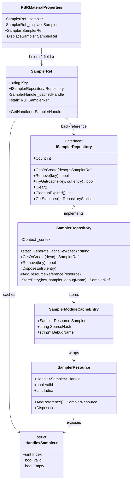

# Design Document — `sampler-ref-wrapper`

## Overview

`SamplerRef` is a lightweight wrapper class that decouples consumers from the `SamplerResource` lifecycle. Instead of holding a reference-counted `SamplerResource` directly, consumers hold a `SamplerRef` that stores a cache key and a back-reference to `ISamplerRepository`. When the GPU handle is needed (e.g. to read the bindless index for a shader), the consumer calls `GetHandle()`. The wrapper returns the cached `SamplerHandle` if it is still valid; otherwise it re-fetches from the repository by key.

This design mirrors the `TextureRef` pattern introduced in the `texture-ref-wrapper` spec, applied to the sampler subsystem. It eliminates two classes of bugs present in the current code:

1. **Stale handles after repository disposal** — `PBRMaterialProperties` currently stores `SamplerResource _sampler` and `SamplerResource _displaceSampler` directly. If the repository disposes the underlying GPU sampler, the material keeps the old (now-invalid) handle.
2. **Caller-managed reference counts** — callers currently must call `AddReference` on cache hits and `Dispose` when done. `SamplerRef` removes this obligation entirely; `SamplerRepository` is the sole owner of every `SamplerResource`.

`ISamplerRepository` gains a `Remove` operation to support runtime destruction. `PBRMaterialProperties` sampler fields change from `SamplerResource` to `SamplerRef`, and shader index writes change from `value.Index` to `wrapper.GetHandle().Index`.

The key difference from the texture variant is that samplers are created from a `SamplerStateDesc` descriptor (not streams, files, or images), and **replace is not supported** — sampler descriptors are immutable once created. The cache key is derived from the descriptor fields (excluding `DebugName`) via the existing `SamplerRepository.GenerateCacheKey(SamplerStateDesc)` static method.

---

## Architecture



**Key design decisions:**

- `SamplerRef` is a plain class (not a struct) so it can be shared by reference across multiple consumers. All holders of the same `SamplerRef` automatically see the re-fetched handle after a replace.
- `SamplerRef` does **not** implement `IDisposable`. It owns nothing; the repository owns the `SamplerResource`.
- The `Null` sentinel uses a no-op `NullSamplerRepository` internally so `GetHandle()` on `SamplerRef.Null` never throws.
- `SamplerRepository` is the sole caller of `AddReference` and `Dispose` on `SamplerResource`.
- **Replace is not supported** — sampler descriptors are immutable; the same descriptor always produces the same GPU sampler state, so hot-swapping is not meaningful.

---

## Components and Interfaces

### `SamplerRef`

Lives in `HelixToolkit.Nex.Repository`.

```csharp
public sealed class SamplerRef
{
    public string Key { get; }
    public ISamplerRepository Repository { get; }

    private Handle<Sampler> _cachedHandle;

    public SamplerRef(string key, ISamplerRepository repository, Handle<Sampler> initialHandle)
    {
        Key = key;
        Repository = repository;
        _cachedHandle = initialHandle;
    }

    public Handle<Sampler> GetHandle()
    {
        if (_cachedHandle.Valid)
            return _cachedHandle;

        if (Repository.TryGet(Key, out var entry) && entry is not null)
        {
            _cachedHandle = entry.Sampler.Handle;
            return _cachedHandle;
        }

        // Key no longer exists — return the invalid handle as-is
        return _cachedHandle;
    }

    public static readonly SamplerRef Null = new(
        string.Empty,
        NullSamplerRepository.Instance,
        Handle<Sampler>.Null
    );
}
```

**`GetHandle()` logic (step-by-step):**

1. If `_cachedHandle.Valid` → return it immediately (fast path, no repository call).
2. Otherwise call `Repository.TryGet(Key, out entry)`.
   - If found → update `_cachedHandle` from `entry.Sampler.Handle` and return it.
   - If not found → return the existing invalid handle unchanged.

**Thread safety note:** `GetHandle()` is designed for single-threaded render-thread use. The cached handle field is not protected by a lock. This matches the existing pattern in the engine where GPU handle reads happen on the render thread.

**`NullSamplerRepository`** is a private, internal no-op implementation of `ISamplerRepository` used only by `SamplerRef.Null`. All methods return `SamplerRef.Null` or default values; `TryGet` always returns `false`.

### Updated `ISamplerRepository`

```csharp
public interface ISamplerRepository : IDisposable
{
    int Count { get; }

    // --- GetOrCreate (return type changes from SamplerResource to SamplerRef) ---
    SamplerRef GetOrCreate(SamplerStateDesc desc);

    // --- Remove (new) ---
    bool Remove(string key);

    // --- Existing query API (unchanged) ---
    bool TryGet(string cacheKey, out SamplerModuleCacheEntry? entry);
    void Clear();
    int CleanupExpired();
    RepositoryStatistics GetStatistics();
}
```

### Updated `SamplerRepository`

The `GetOrCreate` method changes its return type from `SamplerResource` to `SamplerRef`. A new `Replace` method and a `Remove` method are added. A private `StoreEntry` helper is extracted (mirroring `TextureRepository`) to avoid duplication between `GetOrCreate` and `Replace`.

Key behavioral changes:

| Method         | Old behaviour                                                  | New behaviour                                                         |
| -------------- | -------------------------------------------------------------- | --------------------------------------------------------------------- |
| `GetOrCreate`  | Returns `SamplerResource`, caller must `AddReference` on hit   | Returns `SamplerRef`; repository manages all ref counts               |
| `StoreEntry`   | Inline in `GetOrCreate`; calls `AddReference` once after `Set` | Extracted helper; returns `new SamplerRef(key, this, sampler.Handle)` |
| `Remove` (new) | —                                                              | `TryRemoveFromCache` + `DisposeEntry`; returns `bool`                 |

**`AddResourceReference` change:** The existing `GetOrCreate` calls `AddResourceReference(cached!.Sampler)` on cache hits. With `SamplerRef`, callers no longer hold a `SamplerResource` directly, so this extra reference on a cache hit must be removed. The repository's own stored reference is sufficient.

**`Remove` implementation sketch:**

```csharp
public bool Remove(string key)
{
    if (TryRemoveFromCache(key, out var removed) && removed is not null)
    {
        DisposeEntry(removed);
        return true;
    }
    return false;
}
```

> **Note:** `TryRemoveFromCache` is the protected helper already added to the `Repository<>` base class during the `texture-ref-wrapper` implementation.

### `NullSamplerRepository`

Lives in the same file as `SamplerRef` (e.g. `SamplerRef.cs`).

```csharp
internal sealed class NullSamplerRepository : ISamplerRepository
{
    public static readonly NullSamplerRepository Instance = new();
    private NullSamplerRepository() { }

    public int Count => 0;
    public SamplerRef GetOrCreate(SamplerStateDesc desc) => SamplerRef.Null;
    public bool Remove(string key) => false;
    public bool TryGet(string cacheKey, out SamplerModuleCacheEntry? entry)
    {
        entry = null;
        return false;
    }
    public void Clear() { }
    public int CleanupExpired() => 0;
    public RepositoryStatistics GetStatistics() => new() { TotalEntries = 0, MaxEntries = 0, TotalHits = 0, TotalMisses = 0 };
    public void Dispose() { }
}
```

### Updated `PBRMaterialProperties`

Two field changes:

| Field              | Old type          | New type     | Default           |
| ------------------ | ----------------- | ------------ | ----------------- |
| `_sampler`         | `SamplerResource` | `SamplerRef` | `SamplerRef.Null` |
| `_displaceSampler` | `SamplerResource` | `SamplerRef` | `SamplerRef.Null` |

Setter pattern changes from:

```csharp
// Before
_sampler = value;
Properties.SamplerIndex = value.Index;
```

to:

```csharp
// After
_sampler = value;
Properties.SamplerIndex = value.GetHandle().Index;
```

`Dispose()` in `PBRMaterialProperties` removes the `Sampler.Dispose()` and `DisplaceSampler.Dispose()` calls. The pool entry is still destroyed via `_pool?.Destroy(_handle)`.

---

## Data Models

### `SamplerRef` fields

| Field           | Type                 | Description                                         |
| --------------- | -------------------- | --------------------------------------------------- |
| `Key`           | `string`             | Cache key identifying the sampler in the repository |
| `Repository`    | `ISamplerRepository` | Back-reference for lazy re-fetch                    |
| `_cachedHandle` | `Handle<Sampler>`    | Cached GPU handle; `Valid == false` when stale      |

### `SamplerModuleCacheEntry` (unchanged)

| Field                  | Type              | Description                           |
| ---------------------- | ----------------- | ------------------------------------- |
| `Sampler` / `Resource` | `SamplerResource` | Reference-counted GPU sampler wrapper |
| `SourceHash`           | `string`          | Cache key (used for deduplication)    |
| `DebugName`            | `string?`         | Optional GPU debug label              |
| `CreatedAt`            | `DateTime`        | For expiration                        |
| `LastAccessedAt`       | `DateTime`        | For LRU eviction                      |
| `AccessCount`          | `int`             | For LRU eviction                      |

### `PBRMaterialProperties` field changes

| Field              | Old type          | New type     | Default           |
| ------------------ | ----------------- | ------------ | ----------------- |
| `_sampler`         | `SamplerResource` | `SamplerRef` | `SamplerRef.Null` |
| `_displaceSampler` | `SamplerResource` | `SamplerRef` | `SamplerRef.Null` |

---

## Data Flow

### Remove operation and subsequent `GetHandle()` returning invalid

```mermaid
sequenceDiagram
    participant Consumer
    participant ref as SamplerRef (key="linear-clamp")
    participant repo as SamplerRepository
    participant res as SamplerResource

    Consumer->>repo: Remove("linear-clamp")
    repo->>res: DisposeEntry → res.Dispose()
    Note over res: GPU handle destroyed; Handle.Valid = false
    repo-->>Consumer: true

    Note over Consumer,ref: Later, on render thread...

    Consumer->>ref: GetHandle()
    ref->>ref: _cachedHandle.Valid? → false (stale)
    ref->>repo: TryGet("linear-clamp", out entry)
    repo-->>ref: false (key not found)
    ref-->>Consumer: returns Handle<Sampler>.Null (Valid = false)
```

---

## Correctness Properties

*A property is a characteristic or behavior that should hold true across all valid executions of a system — essentially, a formal statement about what the system should do. Properties serve as the bridge between human-readable specifications and machine-verifiable correctness guarantees.*

### Property 1: Key and Repository round-trip

*For any* non-null string key and any `ISamplerRepository` instance, constructing a `SamplerRef` with that key and repository should return the same key from `Key` and the same repository instance from `Repository`.

**Validates: Requirements 1.2, 1.3**

---

### Property 2: Valid cached handle is returned without repository access

*For any* `SamplerRef` whose cached handle is valid, calling `GetHandle()` any number of times should return the same handle value and should make zero calls to `Repository.TryGet`.

**Validates: Requirements 1.6**

---

### Property 3: Stale handle triggers re-fetch and returns new handle

*For any* `SamplerRef` whose cached handle has become invalid (stale), calling `GetHandle()` should call `Repository.TryGet` with the stored key and, if the key exists, return the handle from the repository entry and update the internal cache.

**Validates: Requirements 1.7, 1.8**

---

### Property 4: Null sentinel always returns invalid handle

*For any* number of `GetHandle()` calls on `SamplerRef.Null`, the returned handle should always have `Valid == false`.

**Validates: Requirements 1.9**

---

### Property 5: GetOrCreate returns SamplerRef with matching key and repository

*For any* `SamplerStateDesc`, calling `GetOrCreate` should return a `SamplerRef` whose `Key` equals `SamplerRepository.GenerateCacheKey(desc)` and whose `Repository` is the repository instance.

**Validates: Requirements 2.1, 2.2, 2.3**

---

### Property 6: Remove causes existing SamplerRef to return invalid handle

*For any* `SamplerRef` previously returned for a given key, after `Remove(key)` is called, calling `GetHandle()` on that `SamplerRef` should return a handle with `Valid == false`.

**Validates: Requirements 3.2, 3.4**

---

### Property 7: Repository disposal causes all SamplerRef instances to return invalid handle

*For any* `SamplerRef` obtained from a repository, after the repository is disposed, calling `GetHandle()` should return a handle with `Valid == false`.

**Validates: Requirements 4.4**

---

### Property 8: PBRMaterialProperties shader index matches GetHandle().Index

*For any* `SamplerRef` assigned to a sampler field on `PBRMaterialProperties`, the corresponding shader index field (`Properties.SamplerIndex` or `Properties.DisplaceSamplerIndex`) should equal `wrapper.GetHandle().Index` at the time of assignment.

**Validates: Requirements 5.2**

---

## Error Handling

| Scenario                                       | Behaviour                                                                                     |
| ---------------------------------------------- | --------------------------------------------------------------------------------------------- |
| `GetHandle()` called after repository disposed | `TryGet` returns `false`; `GetHandle()` returns the stale (invalid) handle. No exception.     |
| `GetHandle()` called on `SamplerRef.Null`      | `NullSamplerRepository.TryGet` returns `false`; returns `Handle<Sampler>.Null`. No exception. |
| `Remove` called with non-existent key          | Returns `false`; no side effects.                                                             |
| `GetOrCreate` called on disposed context       | `ObjectDisposedException` thrown (unchanged from current behaviour).                          |

---

## Testing Strategy

### Unit tests (example-based)

- Verify `SamplerRef` is a class type (`typeof(SamplerRef).IsClass`).
- Verify `SamplerRef.Null.GetHandle()` returns an invalid handle.
- Verify `PBRMaterialProperties.Null` has `Sampler == SamplerRef.Null` and `DisplaceSampler == SamplerRef.Null`.
- Verify `PBRMaterialProperties.Dispose()` does not call `SamplerResource.Dispose()` directly.
- Verify `Remove` returns `false` for a non-existent key.
- Verify `TryGet` still returns the correct `SamplerModuleCacheEntry` (API compatibility).

### Property-based tests

Property-based testing is appropriate here because `SamplerRef.GetHandle()` is a pure-ish function whose correctness must hold across all keys, all repository states, and all sequences of replace/remove operations. The input space (arbitrary string keys, arbitrary sequences of operations) is large and edge cases (empty string keys, repeated replaces, replace-then-remove) are best found by a generator.

**Library:** [FsCheck](https://fscheck.github.io/FsCheck/) 3.3.2 (already a dependency of `HelixToolkit.Nex.Repository.Tests`).

**Minimum iterations:** 100 per property test.

**Tag format:** `// Feature: sampler-ref-wrapper, Property {N}: {property_text}`

Each correctness property maps to one property-based test:

| Property | Test description                                                                                                                                                                          |
| -------- | ----------------------------------------------------------------------------------------------------------------------------------------------------------------------------------------- |
| P1       | Generate random key + mock repository; verify `Key` and `Repository` round-trip                                                                                                           |
| P2       | Generate `SamplerRef` with valid handle + mock repo that counts `TryGet` calls; verify 0 calls after N `GetHandle()` invocations                                                          |
| P3       | Generate `SamplerRef` with invalid handle + mock repo returning a new entry; verify `GetHandle()` calls `TryGet` and returns new handle                                                   |
| P4       | Generate N ∈ [1, 200]; call `SamplerRef.Null.GetHandle()` N times; verify all results are invalid                                                                                         |
| P5       | Generate random `SamplerStateDesc` fields; call `GetOrCreate` on mock repository; verify returned `SamplerRef.Key` matches `GenerateCacheKey(desc)` and `Repository` is the same instance |
| P6       | Generate `SamplerRef` for key K; call `Remove(K)`; verify `GetHandle()` returns invalid                                                                                                   |
| P7       | Generate N `SamplerRef` instances; dispose repository; verify all `GetHandle()` return invalid                                                                                            |
| P8       | Generate `SamplerRef` with known handle index; assign to `PBRMaterialProperties` sampler field; verify shader index field equals `GetHandle().Index`                                      |

**Unit/property balance:** Property tests cover the universal correctness invariants. Unit tests cover specific API contracts, error paths, and the `Null` sentinel. Avoid duplicating coverage — if a property test already covers a scenario, skip the unit test for that scenario.
