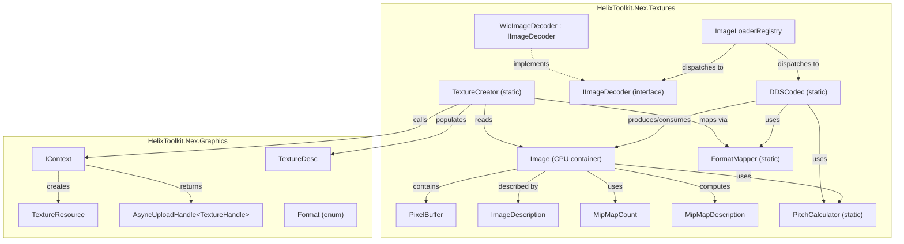

# Design Document: Texture Loading

## Overview

This design translates the SharpDX.Toolkit texture loading library into the `HelixToolkit.Nex.Textures` project, targeting the `HelixToolkit.Nex.Graphics` abstraction layer. The library provides CPU-side image loading, DDS parsing (including DX10 extended headers and legacy D3D9 format conversion), pitch computation, mipmap management, and GPU texture creation via `IContext`.

### Key Design Decisions

1. **No Texture1D**: The target API (`TextureType`) has no `Texture1D`. Any DDS file declaring a 1D texture is promoted to `Texture2D` with `height = 1`. The source `TextureDimension` enum is ported with only `Texture2D`, `Texture3D`, and `TextureCube`.

2. **Nex Format enum is smaller than DXGI**: The target `Format` enum omits BC1–BC6, typeless formats, and most packed 16-bit formats. A `FormatMapper` provides bidirectional mapping between DXGI values (used in DDS files) and Nex `Format`. Unsupported DXGI formats map to `Format.Invalid`.

3. **WIC behind an interface**: WIC uses Windows COM APIs. The design introduces an `IImageDecoder` interface so platform-specific or third-party decoders (e.g., ImageSharp, SkiaSharp) can be plugged in without coupling to Windows.

4. **Unsafe code for performance**: The project enables `AllowUnsafeBlocks`. Pixel buffer manipulation, DDS header parsing, and pitch computation use `unsafe` pointer arithmetic, matching the source library's approach.

5. **Async upload path**: GPU texture creation supports both synchronous (data embedded in `TextureDesc`) and asynchronous (`IContext.UploadAsync`) paths. The async path creates the texture without initial data, then uploads via the transfer queue.

6. **Internal DXGI Format for DDS codec**: The DDS codec internally uses a `DxgiFormat` enum (mirroring the DXGI values needed for DDS header parsing) and converts to/from Nex `Format` at the boundary. This keeps the DDS codec self-contained and faithful to the spec.

## Architecture



### Data Flow

1. **Loading**: `Image.Load(stream)` → `ImageLoaderRegistry` iterates registered loaders → `DDSCodec.LoadFromMemory` or `IImageDecoder.Decode` → produces `Image` with pixel data.
2. **GPU Creation**: `TextureCreator.CreateTexture(ctx, image)` → maps `ImageDescription` to `TextureDesc` via `FormatMapper` → calls `IContext.CreateTexture` → returns `TextureResource`.
3. **Async Upload**: `TextureCreator.CreateTextureAsync(ctx, image)` → creates texture without data → calls `IContext.UploadAsync` with pixel buffer → returns `AsyncUploadHandle<TextureHandle>`.
4. **Saving**: `Image.Save(stream, fileType)` → `ImageLoaderRegistry` finds saver for file type → `DDSCodec.SaveToStream` writes DDS header + pixel data.

## Components and Interfaces

### Image

The central CPU-side container. Manages an unmanaged memory buffer holding all pixel data contiguously. Provides indexed access to `PixelBuffer` instances by array/z-slice and mipmap level.

```csharp
public sealed class Image : IDisposable
{
    public ImageDescription Description { get; }
    public int TotalSizeInBytes { get; }
    public IntPtr DataPointer { get; }

    // Indexed access
    public PixelBuffer GetPixelBuffer(int arrayOrZSliceIndex, int mipmap);
    public PixelBuffer GetPixelBuffer(int arrayIndex, int zIndex, int mipmap);
    public MipMapDescription GetMipMapDescription(int mipmap);

    // Factory methods
    public static Image New(ImageDescription description);
    public static Image New(ImageDescription description, IntPtr dataPointer);
    public static Image New2D(int width, int height, MipMapCount mipMapCount, Format format, int arraySize = 1);
    public static Image New2D(int width, int height, MipMapCount mipMapCount, Format format, int arraySize, IntPtr dataPointer);
    public static Image NewCube(int width, MipMapCount mipMapCount, Format format);
    public static Image NewCube(int width, MipMapCount mipMapCount, Format format, IntPtr dataPointer);
    public static Image New3D(int width, int height, int depth, MipMapCount mipMapCount, Format format);
    public static Image New3D(int width, int height, int depth, MipMapCount mipMapCount, Format format, IntPtr dataPointer);

    // Loading
    public static Image? Load(Stream stream);
    public static Image? Load(string fileName);
    public static Image? Load(byte[] buffer);
    public static Image? Load(IntPtr dataPointer, int dataSize, bool makeACopy = false);

    // Saving
    public void Save(Stream stream, ImageFileType fileType);
    public void Save(string fileName, ImageFileType fileType);

    // Registry
    public static void Register(ImageFileType type, ImageLoadDelegate? loader, ImageSaveDelegate? saver);

    public void Dispose();
}
```

### PixelBuffer

An unmanaged 2D slice of pixel data. Provides typed pixel access.

```csharp
public sealed class PixelBuffer
{
    public int Width { get; }
    public int Height { get; }
    public Format Format { get; set; }
    public int PixelSize { get; }
    public int RowStride { get; }
    public int BufferStride { get; }
    public IntPtr DataPointer { get; }

    public T GetPixel<T>(int x, int y) where T : unmanaged;
    public void SetPixel<T>(int x, int y, T value) where T : unmanaged;
    public T[] GetPixels<T>(int yOffset = 0) where T : unmanaged;
    public void SetPixels<T>(T[] sourcePixels, int yOffset = 0) where T : unmanaged;
    public void CopyTo(PixelBuffer destination);
}
```

### PitchCalculator

Static utility for computing row pitch, slice pitch, and mipmap level counts.

```csharp
public static class PitchCalculator
{
    public static void ComputePitch(Format fmt, int width, int height,
        out int rowPitch, out int slicePitch,
        out int widthCount, out int heightCount,
        PitchFlags flags = PitchFlags.None);

    public static int CalculateMipLevels(int width, MipMapCount mipLevels);
    public static int CalculateMipLevels(int width, int height, MipMapCount mipLevels);
    public static int CalculateMipLevels(int width, int height, int depth, MipMapCount mipLevels);
    public static int CalculateMipSize(int dimension, int mipLevel);
    public static int CountMips(int width, int height);
    public static int CountMips(int width, int height, int depth);
}
```

### FormatMapper

Bidirectional mapping between DXGI format values (used in DDS files) and Nex `Format`.

```csharp
public static class FormatMapper
{
    /// <summary>Maps a DXGI format value to the corresponding Nex Format.</summary>
    public static Format DxgiToNex(DxgiFormat dxgiFormat);

    /// <summary>Maps a Nex Format to the corresponding DXGI format value.</summary>
    public static DxgiFormat NexToDxgi(Format nexFormat);

    /// <summary>Returns true if the DXGI format has a corresponding Nex format.</summary>
    public static bool IsSupported(DxgiFormat dxgiFormat);
}
```

### DDSCodec

Static class for DDS loading and saving. Handles standard headers, DX10 extended headers, and legacy D3D9 format conversion.

```csharp
internal static class DDSCodec
{
    public static Image? LoadFromMemory(IntPtr dataPointer, int dataSize, bool makeACopy, GCHandle? handle);
    public static void SaveToStream(PixelBuffer[] pixelBuffers, int count, ImageDescription description, Stream stream);
}
```

### IImageDecoder / ImageLoaderRegistry

Pluggable image decoding interface and registry.

```csharp
public interface IImageDecoder
{
    /// <summary>Attempts to decode image data. Returns null if format is not recognized.</summary>
    Image? Decode(IntPtr dataPointer, int dataSize, bool makeACopy, GCHandle? handle);

    /// <summary>Saves pixel buffers to a stream in the decoder's format.</summary>
    void Save(PixelBuffer[] pixelBuffers, int count, ImageDescription description, Stream stream);
}

// ImageLoaderRegistry is internal to Image, using the same delegate-based
// registration pattern as the source. DDS is registered by default.
```

### TextureCreator

Creates GPU `TextureResource` objects from `Image` data.

```csharp
public static class TextureCreator
{
    public static TextureResource CreateTexture(IContext context, Image image, string? debugName = null);

    public static AsyncUploadHandle<TextureHandle> CreateTextureAsync(
        IContext context, Image image, string? debugName = null);

    public static TextureResource CreateTextureFromStream(
        IContext context, Stream stream, string? debugName = null);

    public static AsyncUploadHandle<TextureHandle> CreateTextureFromStreamAsync(
        IContext context, Stream stream, string? debugName = null);
}
```

### DxgiFormat (internal enum)

An internal enum mirroring the DXGI format values needed for DDS header parsing. This keeps the DDS codec self-contained without depending on an external DXGI library.

```csharp
internal enum DxgiFormat : uint
{
    Unknown = 0,
    R32G32B32A32_Float = 2,
    R16G16B16A16_Float = 10,
    R16G16B16A16_UNorm = 11,
    R16G16B16A16_SNorm = 13,
    R32G32_Float = 16,
    R10G10B10A2_UNorm = 24,
    R8G8B8A8_UNorm = 28,
    R8G8B8A8_UNorm_SRgb = 29,
    R16G16_Float = 34,
    R16G16_UNorm = 35,
    R32_Float = 41,
    R8G8_UNorm = 49,
    R16_Float = 54,
    R16_UNorm = 56,
    R8_UNorm = 61,
    A8_UNorm = 65,
    BC1_UNorm = 71,
    BC1_UNorm_SRgb = 72,
    BC2_UNorm = 74,
    BC2_UNorm_SRgb = 75,
    BC3_UNorm = 77,
    BC3_UNorm_SRgb = 78,
    BC4_UNorm = 80,
    BC4_SNorm = 81,
    BC5_UNorm = 83,
    BC5_SNorm = 84,
    B5G6R5_UNorm = 85,
    B5G5R5A1_UNorm = 86,
    B8G8R8A8_UNorm = 87,
    B8G8R8X8_UNorm = 88,
    B8G8R8A8_UNorm_SRgb = 91,
    B8G8R8X8_UNorm_SRgb = 93,
    BC7_UNorm = 98,
    BC7_UNorm_SRgb = 99,
    // ... additional values as needed for legacy format table
}
```

## Data Models

### ImageDescription

```csharp
public struct ImageDescription : IEquatable<ImageDescription>
{
    public TextureDimension Dimension;
    public int Width;
    public int Height;
    public int Depth;
    public int ArraySize;
    public int MipLevels;
    public Format Format;  // Nex Format

    // IEquatable, ==, !=, GetHashCode, ToString
}
```

### TextureDimension

```csharp
public enum TextureDimension
{
    Texture2D,
    Texture3D,
    TextureCube,
}
```

Note: `Texture1D` is intentionally omitted. DDS files declaring 1D textures are promoted to `Texture2D` with `height = 1`.

### MipMapCount

```csharp
[StructLayout(LayoutKind.Sequential, Size = 4)]
public readonly struct MipMapCount : IEquatable<MipMapCount>
{
    public static readonly MipMapCount Auto = new(true);
    public readonly int Count;  // 0 = all mipmaps, 1 = single level, N = exact count

    public MipMapCount(bool allMipMaps);  // true → Count=0, false → Count=1
    public MipMapCount(int count);        // throws if count < 0

    // Implicit conversions: bool ↔ MipMapCount, int ↔ MipMapCount
    // IEquatable, ==, !=, GetHashCode
}
```

### MipMapDescription

```csharp
public sealed class MipMapDescription : IEquatable<MipMapDescription>
{
    public readonly int Width;
    public readonly int Height;
    public readonly int Depth;
    public readonly int RowStride;
    public readonly int DepthStride;
    public readonly int MipmapSize;     // = DepthStride * Depth
    public readonly int WidthPacked;    // block-aligned width for compressed formats
    public readonly int HeightPacked;   // block-aligned height for compressed formats

    // IEquatable, ==, !=, GetHashCode
}
```

### ImageFileType

```csharp
public enum ImageFileType
{
    Dds,
    Png,
    Gif,
    Jpg,
    Bmp,
    Tiff,
    Wmp,
    Tga,
}
```

### PitchFlags

```csharp
[Flags]
internal enum PitchFlags
{
    None = 0x0,
    LegacyDword = 0x1,
    Bpp24 = 0x10000,
    Bpp16 = 0x20000,
    Bpp8 = 0x40000,
}
```

### FormatMapper Mapping Table

| DXGI Format         | Nex Format     |
| ------------------- | -------------- |
| R8G8B8A8_UNorm      | RGBA_UN8       |
| R8G8B8A8_UNorm_SRgb | RGBA_SRGB8     |
| B8G8R8A8_UNorm      | BGRA_UN8       |
| B8G8R8A8_UNorm_SRgb | BGRA_SRGB8     |
| R8_UNorm            | R_UN8          |
| R16_UNorm           | R_UN16         |
| R16_Float           | R_F16          |
| R32_Float           | R_F32          |
| R8G8_UNorm          | RG_UN8         |
| R16G16_Float        | RG_F16         |
| R32G32_Float        | RG_F32         |
| R16G16B16A16_Float  | RGBA_F16       |
| R32G32B32A32_Float  | RGBA_F32       |
| BC7_UNorm           | BC7_RGBA       |
| R10G10B10A2_UNorm   | A2R10G10B10_UN |
| All others          | Format.Invalid |


## Correctness Properties

*A property is a characteristic or behavior that should hold true across all valid executions of a system — essentially, a formal statement about what the system should do. Properties serve as the bridge between human-readable specifications and machine-verifiable correctness guarantees.*

### Property 1: Image creation preserves description

*For any* valid `ImageDescription` (positive dimensions, valid format, valid mip levels), creating an `Image` via `Image.New(description)` SHALL produce an Image whose `Description` field equals the input description (with MipLevels resolved if Auto was specified).

**Validates: Requirements 1.1, 2.1**

### Property 2: PixelBuffer access returns correct mip-level dimensions

*For any* valid `Image` and *for any* valid `(arrayOrZSlice, mipLevel)` pair within bounds, `GetPixelBuffer(arrayOrZSlice, mipLevel)` SHALL return a `PixelBuffer` whose `Width` equals `max(1, image.Description.Width >> mipLevel)` and whose `Height` equals `max(1, image.Description.Height >> mipLevel)`.

**Validates: Requirements 1.5, 1.6**

### Property 3: Out-of-range pixel buffer access throws

*For any* valid `Image` and *for any* index tuple where at least one index exceeds its valid range, `GetPixelBuffer` SHALL throw an `ArgumentException`.

**Validates: Requirements 1.7**

### Property 4: CountMips matches logarithmic formula

*For any* positive integers `width` and `height`, `CountMips(width, height)` SHALL equal `1 + floor(log2(max(width, height)))`. Similarly, *for any* positive integers `width`, `height`, and `depth`, `CountMips(width, height, depth)` SHALL equal `1 + floor(log2(max(width, height, depth)))`.

**Validates: Requirements 3.1, 3.2**

### Property 5: CalculateMipSize halves dimensions

*For any* positive integer `dimension` and non-negative integer `mipLevel`, `CalculateMipSize(dimension, mipLevel)` SHALL equal `max(1, dimension >> mipLevel)`.

**Validates: Requirements 3.3**

### Property 6: BCn compressed pitch computation

*For any* BCn compressed format and *for any* positive `width` and `height`, `ComputePitch` SHALL produce `rowPitch = max(1, (width + 3) / 4) * blockByteSize` and `slicePitch = rowPitch * max(1, (height + 3) / 4)`, where `blockByteSize` is 8 for BC1/BC4 and 16 for BC2/BC3/BC5/BC6/BC7.

**Validates: Requirements 4.1, 4.2**

### Property 7: Uncompressed pitch computation

*For any* uncompressed format with known bits-per-pixel and *for any* positive `width` and `height`, `ComputePitch` SHALL produce `rowPitch = (width * bpp + 7) / 8` and `slicePitch = rowPitch * height`.

**Validates: Requirements 4.3, 4.4**

### Property 8: DWORD-aligned pitch computation

*For any* uncompressed format and *for any* positive `width`, when the `LegacyDword` flag is set, `ComputePitch` SHALL produce `rowPitch = ((width * bpp + 31) / 32) * 4`.

**Validates: Requirements 4.5**

### Property 9: Format mapper round-trip

*For any* Nex `Format` value that has a valid DXGI mapping (i.e., `NexToDxgi(f) != DxgiFormat.Unknown`), `DxgiToNex(NexToDxgi(f))` SHALL equal `f`. Conversely, *for any* DXGI format not in the mapping table, `DxgiToNex` SHALL return `Format.Invalid`.

**Validates: Requirements 7.16, 7.17**

### Property 10: TextureDesc mapping from Image

*For any* valid `Image`, `TextureCreator.CreateTexture` SHALL produce a `TextureDesc` where: `Type` matches the Image's `Dimension` (Texture2D→Texture2D, Texture3D→Texture3D, TextureCube→TextureCube), `Format` equals `FormatMapper.NexToDxgi` applied in reverse, `Dimensions` matches `(Width, Height, Depth)`, `NumLayers` equals `ArraySize`, and `NumMipLevels` equals `MipLevels`.

**Validates: Requirements 11.1, 11.2, 11.3, 11.4, 11.5**

### Property 11: PixelBuffer SetPixel/GetPixel round-trip

*For any* valid `PixelBuffer` with an uncompressed format and *for any* valid `(x, y)` coordinate and *for any* pixel value of the appropriate type, `SetPixel<T>(x, y, value)` followed by `GetPixel<T>(x, y)` SHALL return the original `value`.

**Validates: Requirements 13.2, 13.3**

### Property 12: PixelBuffer CopyTo preserves pixel data

*For any* two `PixelBuffer` instances with the same width, height, and format (but potentially different row strides), after `source.CopyTo(destination)`, *for all* valid `(x, y)` coordinates, `destination.GetPixel<T>(x, y)` SHALL equal `source.GetPixel<T>(x, y)`.

**Validates: Requirements 13.4**

### Property 13: MipMapCount int conversion round-trip

*For any* non-negative integer `n`, converting to `MipMapCount` and back to `int` SHALL produce `n`. That is, `(int)(MipMapCount)n == n`.

**Validates: Requirements 14.3, 14.4**

### Property 14: MipMapDescription.MipmapSize invariant

*For any* `MipMapDescription`, `MipmapSize` SHALL equal `DepthStride * Depth`.

**Validates: Requirements 15.2**

### Property 15: DDS round-trip preserves description and pixel data

*For any* valid `Image` whose format maps to a DXGI format (i.e., `FormatMapper.NexToDxgi(image.Description.Format) != DxgiFormat.Unknown`), saving to a DDS `MemoryStream` and loading back SHALL produce an `Image` with an equivalent `ImageDescription` and byte-identical pixel buffer content.

**Validates: Requirements 17.1, 17.2**

## Error Handling

### DDS Loading Errors

| Condition                                   | Behavior                                                |
| ------------------------------------------- | ------------------------------------------------------- |
| Data too small for DDS header (< 128 bytes) | Return `null`                                           |
| Invalid magic number (not `0x20534444`)     | Return `null`                                           |
| Invalid header size or pixel format size    | Return `null`                                           |
| Unsupported/unknown pixel format            | Throw `InvalidOperationException`                       |
| DX10 header with ArraySize == 0             | Throw `InvalidOperationException`                       |
| DX10 header with invalid DXGI format        | Throw `InvalidOperationException`                       |
| Cubemap without all 6 faces                 | Throw `InvalidOperationException`                       |
| Texture3D with ArraySize > 1                | Throw `InvalidOperationException`                       |
| DXGI format not mappable to Nex Format      | `FormatMapper` returns `Format.Invalid`; caller decides |

### Image Creation Errors

| Condition                                                       | Behavior                          |
| --------------------------------------------------------------- | --------------------------------- |
| Width, Height, or Depth ≤ 0 (for applicable dimensions)         | Throw `InvalidOperationException` |
| ArraySize == 0                                                  | Throw `InvalidOperationException` |
| TextureCube with ArraySize not multiple of 6                    | Throw `InvalidOperationException` |
| MipMapCount exceeds maximum for dimensions                      | Throw `InvalidOperationException` |
| 3D texture with non-power-of-two dimensions and MipMapCount > 1 | Throw `InvalidOperationException` |
| Unsupported format                                              | Throw `InvalidOperationException` |

### PixelBuffer Errors

| Condition                                   | Behavior                  |
| ------------------------------------------- | ------------------------- |
| DataPointer is `IntPtr.Zero`                | Throw `ArgumentException` |
| CopyTo with mismatched dimensions or format | Throw `ArgumentException` |
| Format change to different pixel size       | Throw `ArgumentException` |

### MipMapCount Errors

| Condition      | Behavior                  |
| -------------- | ------------------------- |
| Negative count | Throw `ArgumentException` |

### GPU Texture Creation Errors

| Condition                                           | Behavior                                                    |
| --------------------------------------------------- | ----------------------------------------------------------- |
| `IContext.CreateTexture` returns error `ResultCode` | Propagate via `ResultCode.CheckResult()` (throws)           |
| Image format maps to `Format.Invalid`               | Throw `InvalidOperationException` before calling `IContext` |

## Testing Strategy

### Test Framework

- **Unit/Example tests**: MSTest (already configured in `HelixToolkit.Nex.Textures.Tests`)
- **Property-based tests**: [FsCheck](https://fscheck.github.io/FsCheck/) with MSTest integration via `FsCheck.Xunit` adapter or direct `Prop.ForAll` usage in MSTest
- **Minimum 100 iterations** per property test

### Property-Based Tests

Each correctness property from the design document maps to a single property-based test. Tests use FsCheck generators to produce random valid inputs.

**Key generators needed:**
- `ValidImageDescription` — generates random dimensions (1–4096), formats from the supported Nex Format set, valid mip levels, array sizes (1–6 for cubes, 1–4 for arrays), and texture dimensions
- `ValidPixelBufferParams` — generates random width (1–512), height (1–512), uncompressed format, and computes correct strides
- `PositiveDimension` — generates random positive integers (1–8192)
- `NexFormat` — generates from the set of valid Nex Format values
- `BcFormat` — generates from BC1–BC7 format values (using DxgiFormat internally)
- `UncompressedFormat` — generates from uncompressed Nex Format values

**Tag format**: Each property test includes a comment:
```csharp
// Feature: texture-loading, Property {N}: {property_text}
```

### Unit Tests (Example-Based)

Unit tests cover:
- Specific format mappings (Req 7.1–7.15): one test per mapping pair
- Factory method variants (New2D, NewCube, New3D): verify correct ImageDescription
- Texture1D promotion to Texture2D (Req 1.3, 5.6)
- DDS cubemap requires all 6 faces (Req 5.4)
- DDS volume texture sets Texture3D (Req 5.5)
- Default TextureUsageBits.Sampled and StorageType.Device (Req 11.6, 11.7)
- MipMapCount bool conversions (Req 14.1, 14.2)
- ImageDescription.ToString includes all fields (Req 16.3)
- IDisposable implementation (Req 1.8, 1.9, 1.10)

### Integration Tests

Integration tests cover:
- Loading known DDS test files (standard, DX10, legacy formats)
- Loading known image files (PNG, JPG, BMP) via IImageDecoder
- GPU texture creation with mock `IContext`
- Async upload workflow with mock `IContext`

### Edge Case Tests

- DDS data too small → returns null
- Invalid DDS magic number → returns null
- Invalid pixel format → throws
- PixelBuffer with IntPtr.Zero → throws
- MipMapCount with negative value → throws
- Non-power-of-two 3D dimensions with mip count > 1 → throws
- No registered loader matches data → returns null
- Register with both loader and saver null → throws
