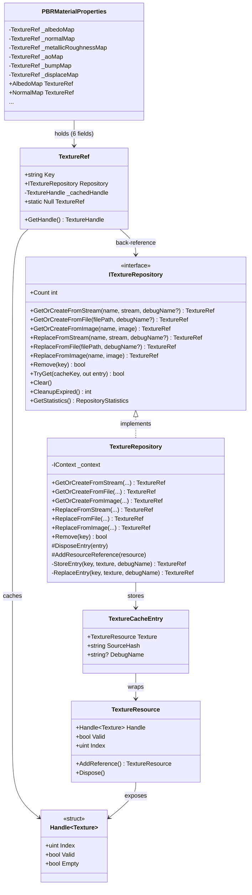

# Design Document — `texture-ref-wrapper`

## Overview

`TextureRef` is a lightweight wrapper class that decouples consumers from the `TextureResource` lifecycle. Instead of holding a reference-counted `TextureResource` directly, consumers hold a `TextureRef` that stores a cache key and a back-reference to `ITextureRepository`. When the GPU handle is needed (e.g. to read the bindless index for a shader), the consumer calls `GetHandle()`. The wrapper returns the cached `TextureHandle` if it is still valid; otherwise it re-fetches from the repository by key.

This design eliminates two classes of bugs present in the current code:

1. **Stale handles after hot-swap** — `PBRMaterialProperties` currently stores a `TextureResource` directly. If the repository replaces the underlying GPU texture, the material keeps the old (now-invalid) handle until it is manually updated.
2. **Caller-managed reference counts** — callers currently must call `AddReference` on cache hits and `Dispose` when done. `TextureRef` removes this obligation entirely; `TextureRepository` is the sole owner of every `TextureResource`.

`ITextureRepository` gains `Remove` and `Replace*` operations to support runtime destruction and hot-swapping. `PBRMaterialProperties` texture map fields change from `TextureResource` to `TextureRef`, and shader index writes change from `value.Index` to `wrapper.GetHandle().Index`.

---

## Architecture



**Key design decisions:**

- `TextureRef` is a plain class (not a struct) so it can be shared by reference across multiple consumers. All holders of the same `TextureRef` automatically see the re-fetched handle after a replace.
- `TextureRef` does **not** implement `IDisposable`. It owns nothing; the repository owns the `TextureResource`.
- The `Null` sentinel uses a no-op `NullTextureRepository` internally so `GetHandle()` on `TextureRef.Null` never throws.
- `TextureRepository` is the sole caller of `AddReference` and `Dispose` on `TextureResource`.

---

## Components and Interfaces

### `TextureRef`

Lives in `HelixToolkit.Nex.Repository`.

```csharp
public sealed class TextureRef
{
    public string Key { get; }
    public ITextureRepository Repository { get; }

    private Handle<Texture> _cachedHandle;

    public TextureRef(string key, ITextureRepository repository, Handle<Texture> initialHandle)
    {
        Key = key;
        Repository = repository;
        _cachedHandle = initialHandle;
    }

    public Handle<Texture> GetHandle()
    {
        if (_cachedHandle.Valid)
            return _cachedHandle;

        if (Repository.TryGet(Key, out var entry) && entry is not null)
        {
            _cachedHandle = entry.Texture.Handle;
            return _cachedHandle;
        }

        // Key no longer exists — return the invalid handle as-is
        return _cachedHandle;
    }

    public static readonly TextureRef Null = new(
        string.Empty,
        NullTextureRepository.Instance,
        Handle<Texture>.Null
    );
}
```

**`GetHandle()` logic (step-by-step):**

1. If `_cachedHandle.Valid` → return it immediately (fast path, no repository call).
2. Otherwise call `Repository.TryGet(Key, out entry)`.
   - If found → update `_cachedHandle` from `entry.Texture.Handle` and return it.
   - If not found → return the existing invalid handle unchanged.

**Thread safety note:** `GetHandle()` is designed for single-threaded render-thread use. The cached handle field is not protected by a lock. This matches the existing pattern in the engine where GPU handle reads happen on the render thread.

**`NullTextureRepository`** is a private, internal no-op implementation of `ITextureRepository` used only by `TextureRef.Null`. All methods return `TextureRef.Null` or default values; `TryGet` always returns `false`.

### Updated `ITextureRepository`

```csharp
public interface ITextureRepository : IDisposable
{
    int Count { get; }

    // --- GetOrCreate (unchanged semantics, new return type) ---
    TextureRef GetOrCreateFromStream(string name, Stream stream, string? debugName = null);
    TextureRef GetOrCreateFromFile(string filePath, string? debugName = null);
    TextureRef GetOrCreateFromImage(string name, Image image);

    // --- Replace (new) ---
    TextureRef ReplaceFromStream(string name, Stream stream, string? debugName = null);
    TextureRef ReplaceFromFile(string filePath, string? debugName = null);
    TextureRef ReplaceFromImage(string name, Image image);

    // --- Remove (new) ---
    bool Remove(string key);

    // --- Existing query API (unchanged) ---
    bool TryGet(string cacheKey, out TextureCacheEntry? entry);
    void Clear();
    int CleanupExpired();
    RepositoryStatistics GetStatistics();
}
```

### Updated `TextureRepository`

The `StoreEntry` helper now returns `TextureRef` instead of `TextureResource`. A new `ReplaceEntry` helper handles the replace path. The `Remove` method is added directly.

Key behavioral changes:

| Method               | Old behaviour                                                | New behaviour                                                                                                               |
| -------------------- | ------------------------------------------------------------ | --------------------------------------------------------------------------------------------------------------------------- |
| `GetOrCreate*`       | Returns `TextureResource`, caller must `AddReference` on hit | Returns `TextureRef`; repository manages all ref counts                                                                     |
| `StoreEntry`         | Calls `AddReference` once after `Set`                        | Same; returns `new TextureRef(key, this, texture.Handle)`                                                                   |
| `ReplaceEntry` (new) | —                                                            | Creates new resource, calls `Set` (which calls `DisposeEntry` on the old entry via `AddOrUpdate`), returns new `TextureRef` |
| `Remove` (new)       | —                                                            | `TryRemove` + `DisposeEntry`; returns `bool`                                                                                |

**`AddResourceReference` change:** The base `Repository<>` calls `AddResourceReference` on cache hits inside `TryGet`. With `TextureRef`, callers no longer hold a `TextureResource` directly, so the repository must **not** add an extra reference on a `GetOrCreate*` cache hit. The `GetOrCreate*` implementations will be updated to skip the `AddResourceReference(cached!.Texture)` call that currently exists — the repository's own stored reference is sufficient.

**`ReplaceEntry` implementation sketch:**

```csharp
private TextureRef ReplaceEntry(string cacheKey, TextureResource newTexture, string debugName)
{
    var newEntry = new TextureCacheEntry
    {
        Resource = newTexture,
        SourceHash = cacheKey,
        DebugName = debugName,
        AccessCount = 1,
    };

    // Set calls AddOrUpdate; the old entry is overwritten but NOT disposed here.
    // We must dispose the old entry manually before calling Set.
    if (TryGetRaw(cacheKey, out var oldEntry) && oldEntry is not null)
    {
        Set(cacheKey, newEntry);
        DisposeEntry(oldEntry);
    }
    else
    {
        Set(cacheKey, newEntry);
    }

    HxDebug.Assert(newTexture.Valid, "Replacement texture resource is not valid after creation.");
    return new TextureRef(cacheKey, this, newTexture.Handle);
}
```

> **Note:** `Set` uses `AddOrUpdate` which replaces the value atomically. To avoid a race where `DisposeEntry` is called on the new entry, the old entry is retrieved first, then `Set` is called, then the old entry is disposed. A `_replaceLock` (or the existing `_evictionLock`) guards this sequence.

**`Remove` implementation sketch:**

```csharp
public bool Remove(string key)
{
    if (_cache.TryRemove(key, out var entry))
    {
        DisposeEntry(entry);
        return true;
    }
    return false;
}
```

---

## Data Models

### `TextureRef` fields

| Field           | Type                 | Description                                         |
| --------------- | -------------------- | --------------------------------------------------- |
| `Key`           | `string`             | Cache key identifying the texture in the repository |
| `Repository`    | `ITextureRepository` | Back-reference for lazy re-fetch                    |
| `_cachedHandle` | `Handle<Texture>`    | Cached GPU handle; `Valid == false` when stale      |

### `TextureCacheEntry` (unchanged)

| Field                  | Type              | Description                           |
| ---------------------- | ----------------- | ------------------------------------- |
| `Texture` / `Resource` | `TextureResource` | Reference-counted GPU texture wrapper |
| `SourceHash`           | `string`          | Cache key (used for deduplication)    |
| `DebugName`            | `string?`         | Optional GPU debug label              |
| `CreatedAt`            | `DateTime`        | For expiration                        |
| `LastAccessedAt`       | `DateTime`        | For LRU eviction                      |
| `AccessCount`          | `int`             | For LRU eviction                      |

### `PBRMaterialProperties` field changes

| Field                   | Old type          | New type     | Default           |
| ----------------------- | ----------------- | ------------ | ----------------- |
| `_albedoMap`            | `TextureResource` | `TextureRef` | `TextureRef.Null` |
| `_normalMap`            | `TextureResource` | `TextureRef` | `TextureRef.Null` |
| `_metallicRoughnessMap` | `TextureResource` | `TextureRef` | `TextureRef.Null` |
| `_aoMap`                | `TextureResource` | `TextureRef` | `TextureRef.Null` |
| `_bumpMap`              | `TextureResource` | `TextureRef` | `TextureRef.Null` |
| `_displaceMap`          | `TextureResource` | `TextureRef` | `TextureRef.Null` |

Setter pattern changes from:

```csharp
// Before
_albedoMap = value;
Properties.AlbedoTexIndex = value.Index;
```

to:

```csharp
// After
_albedoMap = value;
Properties.AlbedoTexIndex = value.GetHandle().Index;
```

`Dispose()` in `PBRMaterialProperties` removes all `AlbedoMap.Dispose()` / `NormalMap.Dispose()` etc. calls. The pool entry is still destroyed via `_pool?.Destroy(_handle)`.

---

## Data Flow

### Replace operation and subsequent `GetHandle()` re-fetch

```mermaid
sequenceDiagram
    participant Consumer
    participant ref as TextureRef (key="albedo")
    participant repo as TextureRepository
    participant oldRes as OldTextureResource
    participant newRes as NewTextureResource

    Note over Consumer,repo: Initial state: ref._cachedHandle is valid (points to oldRes)

    Consumer->>repo: ReplaceFromFile("albedo", newFilePath)
    repo->>newRes: TextureCreator.CreateTextureFromStream(...)
    repo->>repo: ReplaceEntry("albedo", newRes, debugName)
    repo->>oldRes: DisposeEntry(oldEntry) → oldRes.Dispose()
    Note over oldRes: ref count → 0; GPU handle destroyed; Handle.Valid = false
    repo-->>Consumer: returns new TextureRef (or same key)

    Note over Consumer,ref: Later, on render thread...

    Consumer->>ref: GetHandle()
    ref->>ref: _cachedHandle.Valid? → false (old handle is stale)
    ref->>repo: TryGet("albedo", out entry)
    repo-->>ref: entry = {Texture = newRes}
    ref->>ref: _cachedHandle = newRes.Handle (now valid)
    ref-->>Consumer: returns newRes.Handle (valid, new bindless index)
```

### Remove operation and subsequent `GetHandle()` returning invalid

```mermaid
sequenceDiagram
    participant Consumer
    participant ref as TextureRef (key="albedo")
    participant repo as TextureRepository
    participant res as TextureResource

    Consumer->>repo: Remove("albedo")
    repo->>res: DisposeEntry → res.Dispose()
    Note over res: GPU handle destroyed; Handle.Valid = false
    repo-->>Consumer: true

    Note over Consumer,ref: Later, on render thread...

    Consumer->>ref: GetHandle()
    ref->>ref: _cachedHandle.Valid? → false (stale)
    ref->>repo: TryGet("albedo", out entry)
    repo-->>ref: false (key not found)
    ref-->>Consumer: returns Handle<Texture>.Null (Valid = false)
```

---

## Correctness Properties

*A property is a characteristic or behavior that should hold true across all valid executions of a system — essentially, a formal statement about what the system should do. Properties serve as the bridge between human-readable specifications and machine-verifiable correctness guarantees.*

### Property 1: Key and Repository round-trip

*For any* non-null string key and any `ITextureRepository` instance, constructing a `TextureRef` with that key and repository should return the same key from `Key` and the same repository instance from `Repository`.

**Validates: Requirements 1.2, 1.3**

---

### Property 2: Valid cached handle is returned without repository access

*For any* `TextureRef` whose cached handle is valid, calling `GetHandle()` any number of times should return the same handle value and should make zero calls to `Repository.TryGet`.

**Validates: Requirements 1.6**

---

### Property 3: Stale handle triggers re-fetch and returns new handle

*For any* `TextureRef` whose cached handle has become invalid (stale), calling `GetHandle()` should call `Repository.TryGet` with the stored key and, if the key exists, return the handle from the repository entry and update the internal cache.

**Validates: Requirements 1.7, 1.8**

---

### Property 4: Null sentinel always returns invalid handle

*For any* number of `GetHandle()` calls on `TextureRef.Null`, the returned handle should always have `Valid == false`.

**Validates: Requirements 1.9**

---

### Property 5: GetOrCreate* returns TextureRef with matching key

*For any* cache key (whether pre-existing or new), calling `GetOrCreateFromStream`, `GetOrCreateFromFile`, or `GetOrCreateFromImage` should return a `TextureRef` whose `Key` matches the cache key used and whose `Repository` is the repository instance.

**Validates: Requirements 2.1, 2.2, 2.3, 2.4, 2.5**

---

### Property 6: Replace causes existing TextureRef to re-fetch new handle

*For any* `TextureRef` previously returned for a given key, after a `Replace*` call on that key, calling `GetHandle()` on the existing `TextureRef` should return a valid handle whose `Index` matches the new resource's bindless index (not the old one).

**Validates: Requirements 3.4, 3.6**

---

### Property 7: Remove causes existing TextureRef to return invalid handle

*For any* `TextureRef` previously returned for a given key, after `Remove(key)` is called, calling `GetHandle()` on that `TextureRef` should return a handle with `Valid == false`.

**Validates: Requirements 4.2, 4.4**

---

### Property 8: Repository disposal causes all TextureRef instances to return invalid handle

*For any* `TextureRef` obtained from a repository, after the repository is disposed, calling `GetHandle()` should return a handle with `Valid == false`.

**Validates: Requirements 5.4**

---

### Property 9: PBRMaterialProperties shader index matches GetHandle().Index

*For any* `TextureRef` assigned to a texture map field on `PBRMaterialProperties`, the corresponding shader index field (e.g. `Properties.AlbedoTexIndex`) should equal `wrapper.GetHandle().Index` at the time of assignment.

**Validates: Requirements 6.2**

---

## Error Handling

| Scenario                                       | Behaviour                                                                                     |
| ---------------------------------------------- | --------------------------------------------------------------------------------------------- |
| `GetHandle()` called after repository disposed | `TryGet` returns `false`; `GetHandle()` returns the stale (invalid) handle. No exception.     |
| `GetHandle()` called on `TextureRef.Null`      | `NullTextureRepository.TryGet` returns `false`; returns `Handle<Texture>.Null`. No exception. |
| `Remove` called with non-existent key          | Returns `false`; no side effects.                                                             |
| `Replace*` called with non-existent key        | Behaves identically to the corresponding `GetOrCreate*`; creates and stores a new entry.      |
| `GetOrCreate*` called with null/empty name     | `ArgumentException` thrown (unchanged from current behaviour).                                |
| `GetOrCreateFromFile` called with missing file | `FileNotFoundException` thrown (unchanged).                                                   |
| `TextureCreator` fails during `Replace*`       | Exception propagates to caller; old entry is not disposed (repository remains consistent).    |

---

## Testing Strategy

### Unit tests (example-based)

- Verify `TextureRef` is a class type (`typeof(TextureRef).IsClass`).
- Verify `TextureRef.Null.GetHandle()` returns an invalid handle.
- Verify `PBRMaterialProperties` default map fields are `TextureRef.Null`.
- Verify `PBRMaterialProperties.Dispose()` does not call `TextureResource.Dispose()` directly.
- Verify `Remove` returns `false` for a non-existent key.
- Verify `Replace*` on a non-existent key behaves like `GetOrCreate*`.
- Verify `TryGet` still returns the correct `TextureCacheEntry` (API compatibility).

### Property-based tests

Property-based testing is appropriate here because `TextureRef.GetHandle()` is a pure-ish function whose correctness must hold across all keys, all repository states, and all sequences of replace/remove operations. The input space (arbitrary string keys, arbitrary sequences of operations) is large and edge cases (empty string keys, Unicode keys, repeated replaces, replace-then-remove) are best found by a generator.

**Library:** [FsCheck](https://fscheck.github.io/FsCheck/) (the standard PBT library for .NET/xUnit projects).

**Minimum iterations:** 100 per property test.

**Tag format:** `// Feature: texture-ref-wrapper, Property {N}: {property_text}`

Each correctness property maps to one property-based test:

| Property | Test description                                                                                                                                 |
| -------- | ------------------------------------------------------------------------------------------------------------------------------------------------ |
| P1       | Generate random key + mock repository; verify `Key` and `Repository` round-trip                                                                  |
| P2       | Generate `TextureRef` with valid handle + mock repo that counts `TryGet` calls; verify 0 calls after N `GetHandle()` invocations                 |
| P3       | Generate `TextureRef` with invalid handle + mock repo returning a new entry; verify `GetHandle()` calls `TryGet` and returns new handle          |
| P4       | Generate N ∈ [1, 200]; call `TextureRef.Null.GetHandle()` N times; verify all results are invalid                                                |
| P5       | Generate random key; call `GetOrCreate*` on mock repository; verify returned `TextureRef.Key` matches                                            |
| P6       | Generate `TextureRef` for key K; call `Replace*`; verify `GetHandle()` returns new handle index                                                  |
| P7       | Generate `TextureRef` for key K; call `Remove(K)`; verify `GetHandle()` returns invalid                                                          |
| P8       | Generate N `TextureRef` instances; dispose repository; verify all `GetHandle()` return invalid                                                   |
| P9       | Generate `TextureRef` with known handle index; assign to `PBRMaterialProperties` map field; verify shader index field equals `GetHandle().Index` |

**Unit/property balance:** Property tests cover the universal correctness invariants. Unit tests cover specific API contracts, error paths, and the `Null` sentinel. Avoid duplicating coverage — if a property test already covers a scenario, skip the unit test for that scenario.
