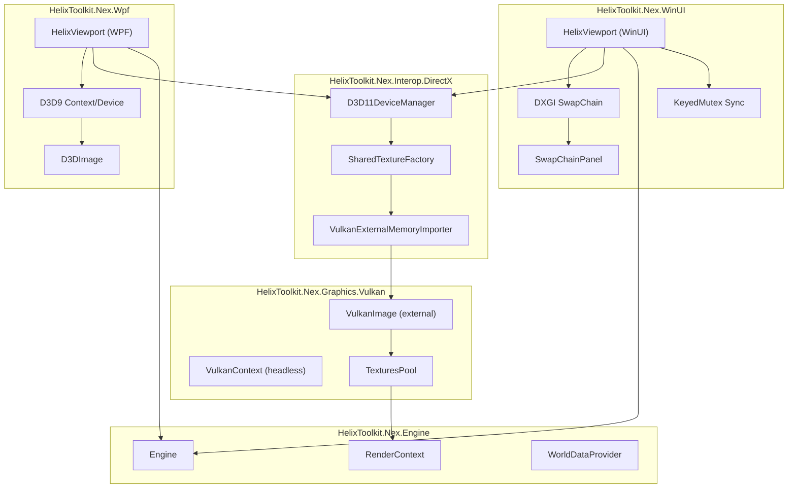
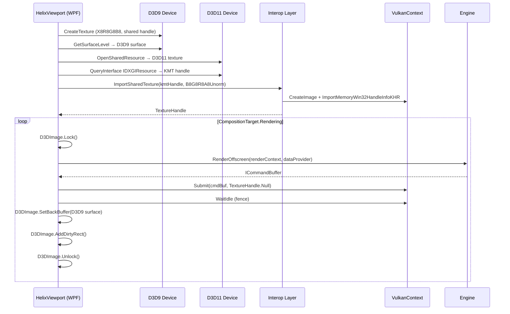
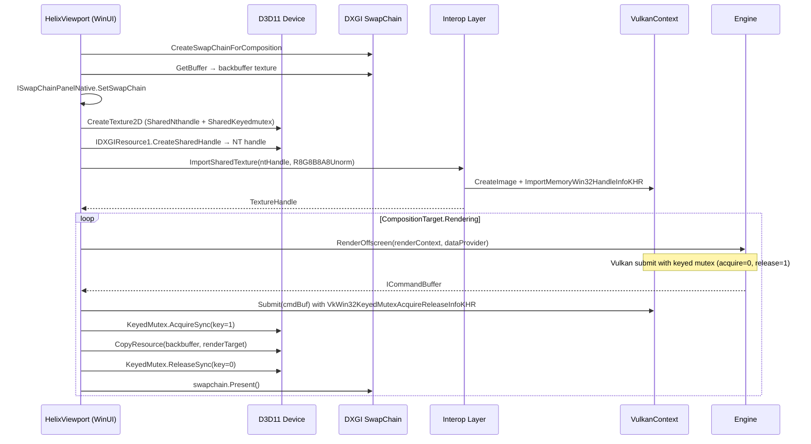
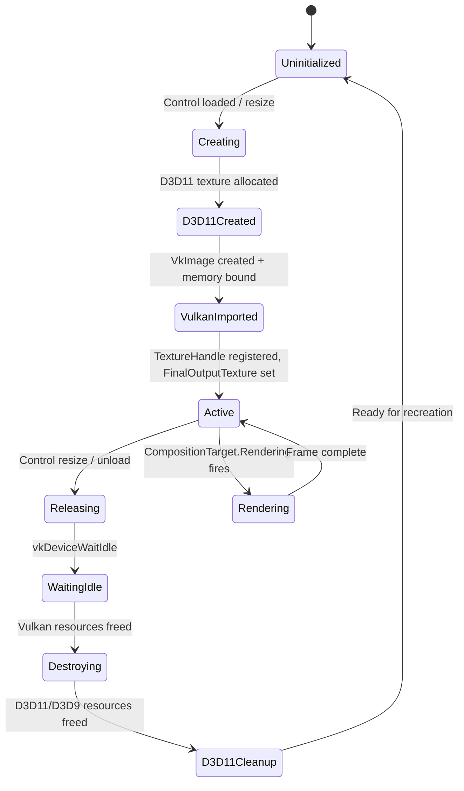
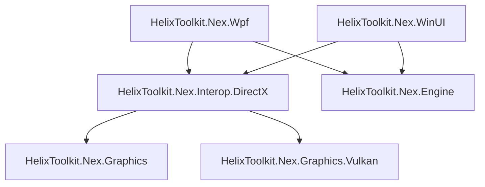

# Design Document: WPF & WinUI Integration

## Overview

This design describes how to embed the HelixToolkit.Nex Vulkan 3D engine into WPF and WinUI 3 desktop applications. The approach uses the `VK_KHR_external_memory_win32` Vulkan extension to share GPU textures between Vulkan and DirectX, enabling the engine's offscreen render output to appear in WPF's `D3DImage` and WinUI's `SwapChainPanel`.

Three new projects are introduced:

1. **HelixToolkit.Nex.Interop.DirectX** — shared interop layer handling D3D11 device creation, shared texture allocation, Vulkan external memory import, and LUID-based GPU matching.
2. **HelixToolkit.Nex.Wpf** — WPF control (`HelixViewport`) using D3D9/D3D11 shared textures and `D3DImage`.
3. **HelixToolkit.Nex.WinUI** — WinUI 3 control (`HelixViewport`) using DXGI swap chain, keyed mutex synchronization, and `SwapChainPanel`.

The engine renders offscreen via `Engine.RenderOffscreen()` into a Vulkan image backed by shared DirectX memory. The WPF/WinUI controls drive the render loop from `CompositionTarget.Rendering` and present the result through their respective UI surfaces.

## Architecture



### Data Flow — WPF Path



### Data Flow — WinUI Path



### Key Design Decisions

1. **Vortice.Vulkan for Vulkan, Silk.NET for DirectX**: The engine already uses Vortice.Vulkan. For DirectX bindings (D3D11, D3D9, DXGI), we use Silk.NET since the reference `vulkan-interop-directx` project already validates this combination and Vortice does not provide D3D9 bindings needed for the WPF path.

2. **Headless VulkanContext**: The interop layer creates the VulkanContext via `VulkanBuilder.CreateHeadless()` with `EnableExternalMemoryWin32 = true`. This avoids creating a window surface or swapchain — the engine renders entirely offscreen.

3. **External VulkanImage via second constructor**: The existing `VulkanImage` has a constructor that accepts a pre-created `VkImage` with `isOwningVkImage = false`. The interop layer creates the `VkImage` with external memory, then wraps it in a `VulkanImage` using this constructor. The image is registered in `TexturesPool` to obtain a `TextureHandle`.

4. **RenderToFinalNode with external texture format**: `EngineBuilder.WithDefaultNodes(renderToSwapchain: false)` omits `RenderToFinalNode`. The WPF/WinUI controls add `RenderToFinalNode` manually with the correct format (`B8G8R8A8Unorm` for WPF, `R8G8B8A8Unorm` for WinUI) so the render graph copies the final HDR color buffer to the external texture.

5. **LUID matching before context creation**: The interop layer creates the D3D11 device first, retrieves the DXGI adapter LUID, then passes it to a custom physical device selector on `VulkanContextConfig` so the `VulkanContext` picks the matching GPU during initialization.


## Components and Interfaces

### 1. VulkanContextConfig Extension

```csharp
// In HelixToolkit.Nex.Graphics.Vulkan/VulkanContextConfig
public sealed class VulkanContextConfig
{
    // ... existing fields ...

    /// <summary>
    /// When true, enables VK_KHR_external_memory_win32 and VK_KHR_external_memory
    /// device extensions during Vulkan device creation. Default false.
    /// </summary>
    public bool EnableExternalMemoryWin32 = false;

    /// <summary>
    /// Optional LUID filter. When set, VulkanContext will only select a physical device
    /// whose VkPhysicalDeviceIDProperties.deviceLUID matches this value.
    /// Used by the interop layer to ensure Vulkan and DirectX use the same GPU.
    /// </summary>
    public byte[]? RequiredDeviceLuid = null;
}
```

During `VulkanContext.InitContext()`, when `EnableExternalMemoryWin32` is true, the following extensions are added to `_deviceExtensions`:
- `VK_KHR_external_memory` (instance-level dependency already satisfied by Vulkan 1.3)
- `VK_KHR_external_memory_win32`

When `RequiredDeviceLuid` is set, the physical device selection loop in `InitContext()` queries `VkPhysicalDeviceIDProperties` for each candidate and skips devices whose LUID does not match.

### 2. Interop Layer — D3D11DeviceManager

```csharp
namespace HelixToolkit.Nex.Interop.DirectX;

/// <summary>
/// Manages the D3D11 device and provides the DXGI adapter LUID.
/// Shared by both WPF and WinUI paths.
/// </summary>
public sealed class D3D11DeviceManager : IDisposable
{
    public ComPtr<ID3D11Device> Device { get; }
    public ComPtr<ID3D11DeviceContext> DeviceContext { get; }
    public Luid AdapterLuid { get; }

    public D3D11DeviceManager();
    public void Dispose();
}
```

### 3. Interop Layer — SharedTextureFactory

```csharp
namespace HelixToolkit.Nex.Interop.DirectX;

public enum SharedHandleType { Kmt, Nt }

/// <summary>
/// Result of creating a shared D3D11 texture.
/// </summary>
public sealed class SharedTextureResult : IDisposable
{
    public ComPtr<ID3D11Texture2D> Texture { get; }
    public nint SharedHandle { get; }
    public SharedHandleType HandleType { get; }
    public uint Width { get; }
    public uint Height { get; }
    public void Dispose();
}

/// <summary>
/// Creates D3D11 textures in shared mode for Vulkan interop.
/// </summary>
public static class SharedTextureFactory
{
    /// <summary>
    /// Creates a D3D11 shared texture for the WPF path (KMT handle).
    /// Opens a D3D9 shared texture on the D3D11 side and returns the KMT handle.
    /// </summary>
    public static SharedTextureResult CreateForWpf(
        D3D11DeviceManager d3d11,
        ComPtr<IDirect3DTexture9> d3d9Texture);

    /// <summary>
    /// Creates a D3D11 shared texture for the WinUI path (NT handle).
    /// Creates a new D3D11 texture with SharedNthandle + SharedKeyedmutex flags.
    /// </summary>
    public static SharedTextureResult CreateForWinUI(
        D3D11DeviceManager d3d11,
        uint width, uint height);
}
```

### 4. Interop Layer — VulkanExternalMemoryImporter

```csharp
namespace HelixToolkit.Nex.Interop.DirectX;

/// <summary>
/// Result of importing a shared texture into Vulkan.
/// </summary>
public sealed class ImportedVulkanTexture : IDisposable
{
    public TextureHandle Handle { get; }
    public VkImage Image { get; }
    public VkDeviceMemory Memory { get; }
    public void Dispose();
}

/// <summary>
/// Imports a shared DirectX texture handle into Vulkan as a VkImage.
/// </summary>
public static class VulkanExternalMemoryImporter
{
    /// <summary>
    /// Imports a shared handle into Vulkan using VK_KHR_external_memory_win32.
    /// Creates a VkImage with ExternalMemoryImageCreateInfo, allocates memory with
    /// ImportMemoryWin32HandleInfoKHR, and wraps it as a TextureHandle.
    /// </summary>
    /// <param name="context">The headless VulkanContext with external memory enabled.</param>
    /// <param name="sharedHandle">The KMT or NT handle from D3D11.</param>
    /// <param name="handleType">D3D11TextureKmtBit (WPF) or D3D11TextureBit (WinUI).</param>
    /// <param name="format">B8G8R8A8Unorm (WPF) or R8G8B8A8Unorm (WinUI).</param>
    /// <param name="width">Texture width in pixels.</param>
    /// <param name="height">Texture height in pixels.</param>
    /// <returns>The imported texture wrapped as a TextureHandle.</returns>
    public static ImportedVulkanTexture Import(
        IContext context,
        nint sharedHandle,
        VkExternalMemoryHandleTypeFlags handleType,
        VkFormat format,
        uint width, uint height);
}
```

### 5. WPF Control — HelixViewport

```csharp
namespace HelixToolkit.Nex.Wpf;

/// <summary>
/// WPF control that hosts the HelixToolkit.Nex 3D engine output.
/// Uses D3DImage with a D3D9 back buffer surface.
/// </summary>
public class HelixViewport : FrameworkElement, IDisposable
{
    // Public API
    public Engine Engine { get; }
    public RenderContext RenderContext { get; }
    public WorldDataProvider WorldDataProvider { get; }

    // Internal state
    private D3DImage _d3dImage;
    private D3D11DeviceManager _d3d11Manager;
    private D3D9DeviceManager _d3d9Manager;  // D3D9 context + device
    private ComPtr<IDirect3DTexture9> _d3d9BackBuffer;
    private ComPtr<IDirect3DSurface9> _d3d9Surface;
    private SharedTextureResult _sharedTexture;
    private ImportedVulkanTexture _importedTexture;
    private IContext _vulkanContext;
    private TimeSpan _lastRenderTime;

    protected override void OnRender(DrawingContext drawingContext);
    private void OnLoaded(object sender, RoutedEventArgs e);
    private void OnUnloaded(object sender, RoutedEventArgs e);
    private void OnRendering(object? sender, EventArgs e);
    private void OnSizeChanged(object sender, SizeChangedEventArgs e);
    private void CreateResources(uint width, uint height);
    private void ReleaseResources();
    public void Dispose();
}
```

### 6. WinUI Control — HelixViewport

```csharp
namespace HelixToolkit.Nex.WinUI;

/// <summary>
/// WinUI 3 control that hosts the HelixToolkit.Nex 3D engine output.
/// Uses SwapChainPanel with DXGI swap chain and keyed mutex synchronization.
/// </summary>
public sealed class HelixViewport : UserControl, IDisposable
{
    // Public API
    public Engine Engine { get; }
    public RenderContext RenderContext { get; }
    public WorldDataProvider WorldDataProvider { get; }

    // Internal state
    private SwapChainPanel _swapChainPanel;
    private D3D11DeviceManager _d3d11Manager;
    private ComPtr<IDXGISwapChain1> _swapchain;
    private ComPtr<ID3D11Texture2D> _backbuffer;
    private SharedTextureResult _sharedTexture;
    private ImportedVulkanTexture _importedTexture;
    private ComPtr<IDXGIKeyedMutex> _keyedMutex;
    private IContext _vulkanContext;

    private void OnLoaded(object sender, RoutedEventArgs e);
    private void OnUnloaded(object sender, RoutedEventArgs e);
    private void OnRendering(object? sender, object e);
    private void OnSizeChanged(object sender, SizeChangedEventArgs e);
    private void CreateResources(uint width, uint height);
    private void ReleaseResources();
    public void Dispose();
}
```

### 7. Keyed Mutex Synchronization (WinUI)

```csharp
namespace HelixToolkit.Nex.Interop.DirectX;

/// <summary>
/// Configuration for keyed mutex synchronization between Vulkan and D3D11.
/// </summary>
public readonly record struct KeyedMutexSyncConfig(
    ulong VulkanAcquireKey,   // 0 — Vulkan goes first
    ulong VulkanReleaseKey,   // 1 — signals D3D11 copy
    ulong CopyAcquireKey,     // 1 — D3D11 waits for Vulkan
    ulong CopyReleaseKey,     // 0 — signals Vulkan for next frame
    uint TimeoutMs = 5000
);

/// <summary>
/// Builds VkWin32KeyedMutexAcquireReleaseInfoKHR for Vulkan queue submit.
/// </summary>
public static class KeyedMutexHelper
{
    public static VkWin32KeyedMutexAcquireReleaseInfoKHR CreateSubmitInfo(
        VkDeviceMemory memory,
        KeyedMutexSyncConfig config);
}
```


## Data Models

### Shared Texture Lifecycle State Machine



### Format Mapping

| Path  | D3D9 Format | D3D11 Format        | Vulkan Format | Handle Type        |
| ----- | ----------- | ------------------- | ------------- | ------------------ |
| WPF   | X8R8G8B8    | (opened via shared) | B8G8R8A8Unorm | D3D11TextureKmtBit |
| WinUI | N/A         | R8G8B8A8Unorm       | R8G8B8A8Unorm | D3D11TextureBit    |

### VulkanContextConfig — New Fields

| Field                       | Type      | Default | Description                                                     |
| --------------------------- | --------- | ------- | --------------------------------------------------------------- |
| `EnableExternalMemoryWin32` | `bool`    | `false` | Enables `VK_KHR_external_memory_win32` device extension.        |
| `RequiredDeviceLuid`        | `byte[]?` | `null`  | When set, restricts physical device selection to matching LUID. |

### ImportedVulkanTexture — Ownership Model

The `ImportedVulkanTexture` owns:
- The `VkDeviceMemory` allocated via `ImportMemoryWin32HandleInfoKHR` (freed on dispose)
- The `VkImage` created with `ExternalMemoryImageCreateInfo` (destroyed on dispose)
- The `VkImageView` created for the image (destroyed on dispose)
- The `TextureHandle` registered in `TexturesPool` (destroyed on dispose)

It does NOT own:
- The D3D11 texture or shared handle (owned by `SharedTextureResult`)
- The D3D9 texture/surface (owned by the WPF control)
- The `VulkanContext` (owned by the control)

### Project Dependencies



### NuGet Dependencies

| Project                          | New NuGet Dependencies                                 |
| -------------------------------- | ------------------------------------------------------ |
| HelixToolkit.Nex.Interop.DirectX | Silk.NET.Direct3D11, Silk.NET.Direct3D9, Silk.NET.DXGI |
| HelixToolkit.Nex.Wpf             | (WPF framework via `<UseWPF>true</UseWPF>`)            |
| HelixToolkit.Nex.WinUI           | Microsoft.WindowsAppSDK                                |


## Correctness Properties

*A property is a characteristic or behavior that should hold true across all valid executions of a system — essentially, a formal statement about what the system should do. Properties serve as the bridge between human-readable specifications and machine-verifiable correctness guarantees.*

### Property 1: Shared texture dimensions match request

*For any* valid width and height (1 ≤ width ≤ 16384, 1 ≤ height ≤ 16384), when `SharedTextureFactory.CreateForWinUI(d3d11, width, height)` is called, the returned `SharedTextureResult.Width` and `SharedTextureResult.Height` shall equal the requested width and height, and `SharedTextureResult.SharedHandle` shall be non-zero.

**Validates: Requirements 1.2**

### Property 2: Dedicated allocation when DedicatedOnlyBit is set

*For any* combination of Vulkan format and external memory handle type where `ExternalMemoryFeatureFlags` includes `DedicatedOnlyBit`, the `VulkanExternalMemoryImporter.Import()` method shall include `MemoryDedicatedAllocateInfo` in the memory allocation chain.

**Validates: Requirements 1.4**

### Property 3: LUID comparison is byte-exact

*For any* two 8-byte LUID values A and B, the LUID matching function shall return `true` if and only if all 8 bytes of A equal the corresponding bytes of B.

**Validates: Requirements 2.2**

### Property 4: FinalOutputTexture round-trip

*For any* valid `TextureHandle`, setting `RenderContext.FinalOutputTexture` to that handle and then reading it back shall return the same handle value.

**Validates: Requirements 7.2**

### Property 5: Resize updates WindowSize and FinalOutputTexture

*For any* valid resize dimensions (width > 0, height > 0), after the control processes a resize event, `RenderContext.WindowSize` shall equal the new dimensions and `RenderContext.FinalOutputTexture` shall be a valid (non-null) `TextureHandle`.

**Validates: Requirements 4.8, 5.8, 8.2**

### Property 6: ImportedVulkanTexture disposal clears resources

*For any* successfully created `ImportedVulkanTexture`, after calling `Dispose()`, the `VkImage` shall be `VK_NULL_HANDLE`, the `VkDeviceMemory` shall be `VK_NULL_HANDLE`, and the `TextureHandle` shall be `TextureHandle.Null`.

**Validates: Requirements 1.6**

### Property 7: Interop layer disposal releases all handles

*For any* fully initialized interop layer (D3D11DeviceManager + SharedTextureResult + ImportedVulkanTexture), after calling `Dispose()` on each component, all COM pointers shall be released (ref count zero) and all Vulkan handles shall be null.

**Validates: Requirements 9.1**


## Error Handling

### Initialization Errors

| Error Condition                                                | Handling                                                                    |
| -------------------------------------------------------------- | --------------------------------------------------------------------------- |
| D3D11 device creation fails                                    | Throw `PlatformNotSupportedException` with HRESULT details                  |
| No Vulkan physical device matches DXGI adapter LUID            | Throw `InvalidOperationException` listing available LUIDs                   |
| `VK_KHR_external_memory_win32` not supported by matched device | Throw `InvalidOperationException` with device name and available extensions |
| External memory handle type not supported for target format    | Throw `NotSupportedException` with format and handle type details           |
| `vkCreateImage` fails for external memory image                | Throw `InvalidOperationException` with VkResult                             |
| `vkAllocateMemory` fails for imported memory                   | Throw `InvalidOperationException` with VkResult and memory requirements     |
| Engine initialization fails                                    | Propagate `InvalidOperationException` from `EngineBuilder.Build()`          |

### Runtime Errors

| Error Condition                                  | Handling                                                       |
| ------------------------------------------------ | -------------------------------------------------------------- |
| Keyed mutex acquire timeout (WinUI)              | Log warning, skip frame, continue render loop                  |
| `D3DImage.IsFrontBufferAvailable` is false (WPF) | Skip frame, continue render loop                               |
| Resize to zero dimensions                        | Skip rendering, keep resources alive, resume when size > 0     |
| `swapchain.Present` fails                        | Log error, attempt recovery on next frame                      |
| Vulkan submit fails                              | Log error, attempt `vkDeviceWaitIdle`, recreate command buffer |

### Disposal Errors

| Error Condition                          | Handling                                            |
| ---------------------------------------- | --------------------------------------------------- |
| Dispose called while GPU work is pending | Call `vkDeviceWaitIdle` before destroying resources |
| Double dispose                           | Guard with `_disposed` flag, no-op on second call   |
| Dispose called from non-UI thread        | Marshal to UI thread for WPF/WinUI resource cleanup |

## Testing Strategy

### Unit Tests

Unit tests focus on isolated logic that does not require GPU hardware:

- **LUID comparison**: Test byte-exact comparison with known LUID values, including edge cases (all zeros, all 0xFF, single-bit differences).
- **KeyedMutexSyncConfig construction**: Verify default key values (Vulkan acquire=0, release=1; copy acquire=1, release=0).
- **VulkanContextConfig defaults**: Verify `EnableExternalMemoryWin32` defaults to `false` and `RequiredDeviceLuid` defaults to `null`.
- **Format mapping**: Verify WPF path uses `B8G8R8A8Unorm` and WinUI path uses `R8G8B8A8Unorm`.
- **Zero-size guard**: Verify that resize with width=0 or height=0 skips resource creation.
- **FinalOutputTexture round-trip**: Set and get `RenderContext.FinalOutputTexture` with various handles.

### Property-Based Tests

Property-based tests use [FsCheck](https://fscheck.github.io/FsCheck/) (the standard .NET PBT library, compatible with xUnit) with a minimum of 100 iterations per property.

Each property test is tagged with a comment referencing the design property:

```csharp
// Feature: wpf-winui-integration, Property 3: LUID comparison is byte-exact
[Property(MaxTest = 100)]
public Property LuidComparisonIsByteExact() => ...
```

Property tests cover:
- **Property 1**: Generate random (width, height) in valid range, create shared texture, verify dimensions match.
- **Property 2**: Generate random format/handleType combinations, mock feature flags, verify dedicated allocation logic.
- **Property 3**: Generate random 8-byte arrays, verify LUID comparison returns true iff bytes match.
- **Property 4**: Generate random TextureHandle indices, set/get FinalOutputTexture, verify round-trip.
- **Property 5**: Generate random resize dimensions, verify WindowSize and FinalOutputTexture after resize.
- **Property 6**: Create ImportedVulkanTexture, dispose, verify all handles are null.
- **Property 7**: Create full interop stack, dispose all, verify all handles are null.

Properties 1, 5, 6, and 7 require GPU hardware and are marked as integration property tests (run in CI with GPU support only). Properties 2, 3, and 4 can run without GPU hardware using mocks.

### Integration Tests

Integration tests require a Windows machine with a GPU supporting Vulkan 1.3 and D3D11:

- **WPF end-to-end**: Create `HelixViewport` in a test WPF window, verify it renders without exceptions, resize, verify render continues, close window, verify cleanup.
- **WinUI end-to-end**: Create `HelixViewport` in a test WinUI window, verify keyed mutex synchronization works, resize, verify render continues, close window, verify cleanup.
- **Multi-GPU**: On systems with multiple GPUs, verify LUID matching selects the correct device.

### Test Configuration

- Framework: xUnit
- PBT library: FsCheck.Xunit
- Minimum iterations: 100 per property test
- GPU-dependent tests: Marked with `[Trait("Category", "GPU")]` for conditional CI execution
