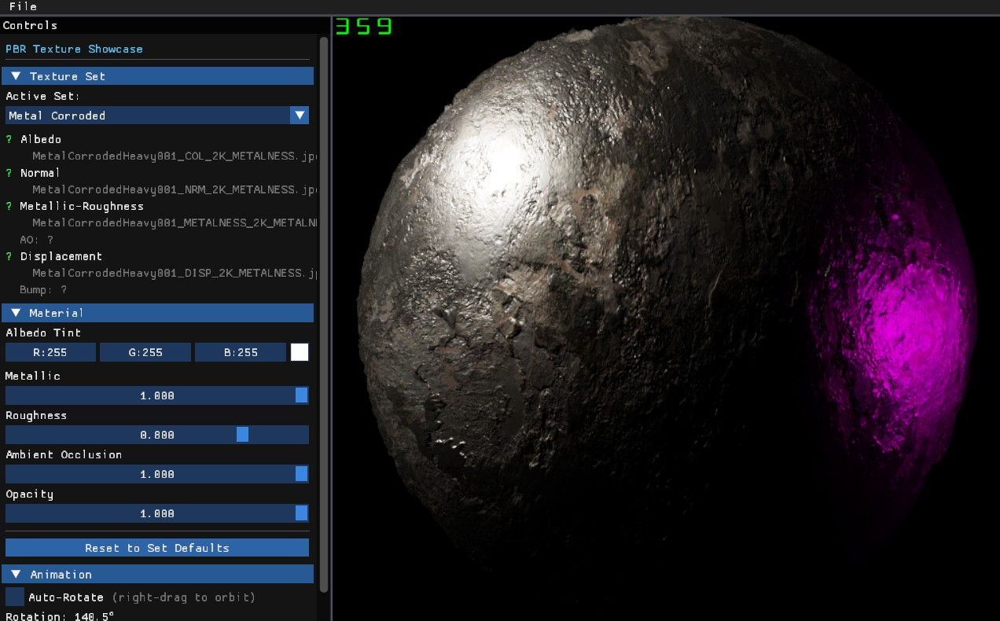
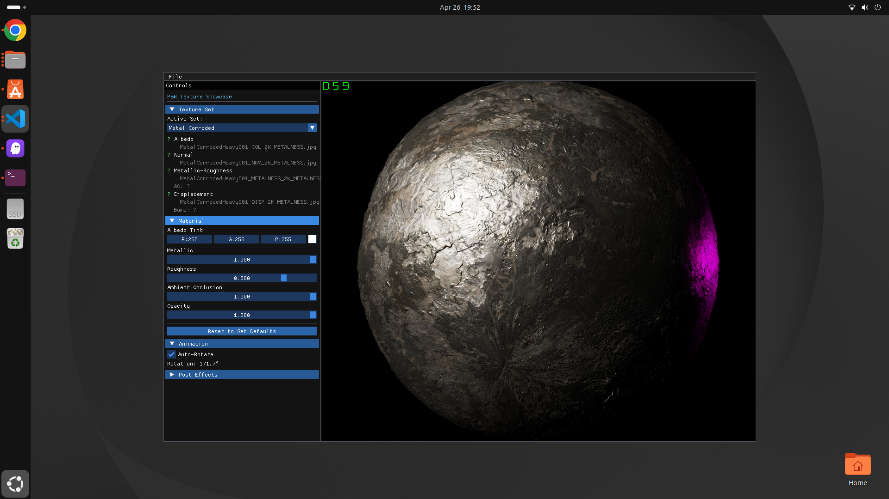

# HelixToolkit Nex 

HelixToolkit Nex is the next generation 3D graphics engine from HelixToolkit. It offers a unified graphics interface designed to support multiple backend implementations, with an initial focus on Vulkan 1.3.

The graphics interface and Vulkan backend are inspired by [LightWeightVk](https://github.com/corporateshark/lightweightvk).

Currently in development.

## Minimum Requirements
- Windows 10 or later
- Linux (Tested on Ubuntu 26.04)
- Vulkan 1.3 compatible GPU and drivers
- .NET 8.0 or later

## Features (Done or In progress)

- [Vulkan backend implementation](Source/HelixToolkit-Nex/HelixToolkit.Nex.Graphics.Vulkan/README.md) (Done)
- Complete bindless descriptor architecture.
- Linux support (Done)
- [ImGui integration](Source/HelixToolkit-Nex/Samples/GraphicsAPI/ImGuiTest/README.md) (Done)
- [Forward+(Tiled based GPU light culling)](Source/HelixToolkit-Nex/Samples/GraphicsAPI/ForwardPlusSimple/README.md) rendering pipeline. (Done)
- Material systems.
  - Physically Based Rendering (Done)
  - Point cloud (Done)
  - Line (Planned)
  - Billboard (Planned)
  - Material registry and shader generation system. (Done)

- [GPU Frustum Culling](Source/HelixToolkit-Nex/Samples/GraphicsAPI/MeshCulling/README.md) and [GPU Frustum Culling on Instancing](Source/HelixToolkit-Nex/Samples/GraphicsAPI/InstancingMeshCulling/README.md). (Done)
- ECS based scene management system. (In Progress)
- Engine architecture design. (In Progress)
  - Render Graph based rendering architecture. (Done)
  - WB Order independent transparency rendering. (Done)
  - PostEffects:
    - SMAA anti-aliasing. (Done)
    - FXAA anti-aliasing. (Done)
    - Bloom post-processing effect. (Done)
    - Object border highlighting effect. (Done) 
    - Wireframe rendering. (Done)
    - Tone mapping post-processing effect. (Done)
  - GPU picking. (Done)
  - Async Buffer/Texture upload with transfer queue. (Done)
  - Texture loading and caching system. (Done)
  - Shader compilation and management system. (Done)
 
- Wpf Framework Interoperation (Done)
- WinUI Interoperation (Done)
- Avalonia UI Interoperation (Planned)

## Rendering Samples

## Linux Support

## Interoperability

- Render content with Vulkan Backend in Wpf and WinUI applications using D3D11 interoperation. (Requires Vulkan Extension: `VK_KHR_external_memory_win32`. Only tested on Discrete Graphics Card.)

    - [WPF](Source/HelixToolkit-Nex/Samples/Interop/Wpf)
    

    - [WinUI](Source/HelixToolkit-Nex/Samples/Interop/WinUI)
    

## Contributing

Interested in contributing? Please read our [Contributing Guide](CONTRIBUTING.md) for information on:
- Development setup and prerequisites
- Code formatting requirements
- Building and testing
- Submitting pull requests
