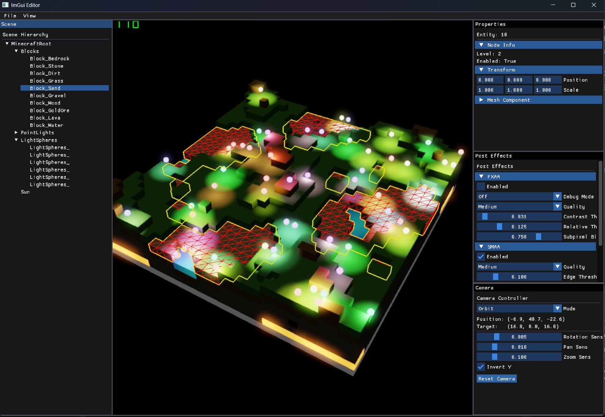

# HelixToolkit Nex

HelixToolkit Nex is the experimental graphics engine from HelixToolkit. It offers a unified graphics interface designed to support multiple backend implementations, with an initial focus on Vulkan.

The graphics interface and Vulkan backend are largely inspired by [LightWeightVk](https://github.com/corporateshark/lightweightvk).

Currently in development.

## Features (Done or In progress)

- Vulkan backend implementation (Done)
- [ImGui integration](Source/HelixToolkit-Nex/Samples/GraphicsAPI/ImGuiTest/README.md) (Done)
- [Forward+(Tiled based GPU light culling)](Source/HelixToolkit-Nex/Samples/GraphicsAPI/ForwardPlusSimple/README.md) rendering pipeline. (Done)
- PBR material system. (In Progress)
  - Material registry and shader generation system. (Done)
- [GPU Frustum Culling](Source/HelixToolkit-Nex/Samples/GraphicsAPI/MeshCulling/README.md) and [GPU Frustum Culling on Instancing](Source/HelixToolkit-Nex/Samples/GraphicsAPI/InstancingMeshCulling/README.md). (Done)
- ECS based scene management system. (In Progress)
- Engine architecture design. (In Progress)
  - Render Graph based rendering architecture. (Done)
  - WB Order independent transparency rendering. (Done)
  - PostEffects:
    - SMAA anti-aliasing. (Done)
    - FXAA anti-aliasing. (Done)
    - Bloom post-processing effect. (Done)
    - Object border highlighting effect. (Done) 
    - Wireframe rendering. (Done)
    - Tone mapping post-processing effect. (Done)
  - GPU Object level picking. (Done)

## Rendering Samples

## Contributing

Interested in contributing? Please read our [Contributing Guide](CONTRIBUTING.md) for information on:
- Development setup and prerequisites
- Code formatting requirements
- Building and testing
- Submitting pull requests
