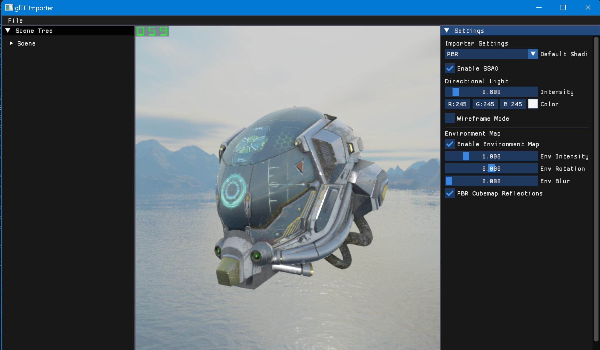
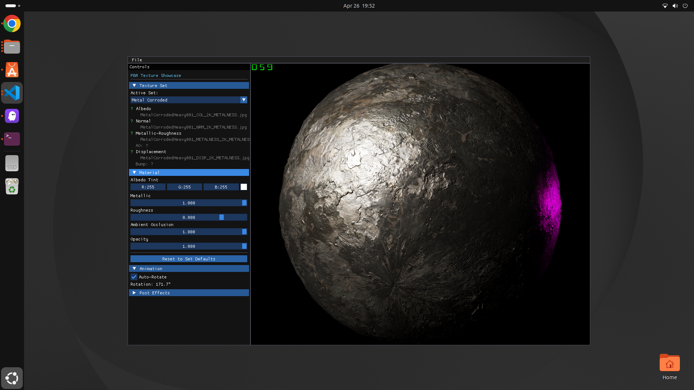
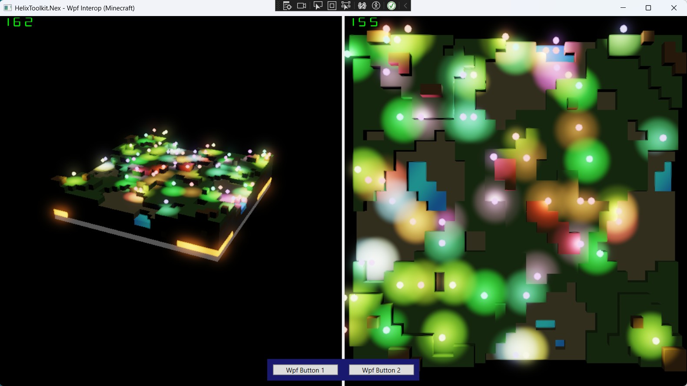
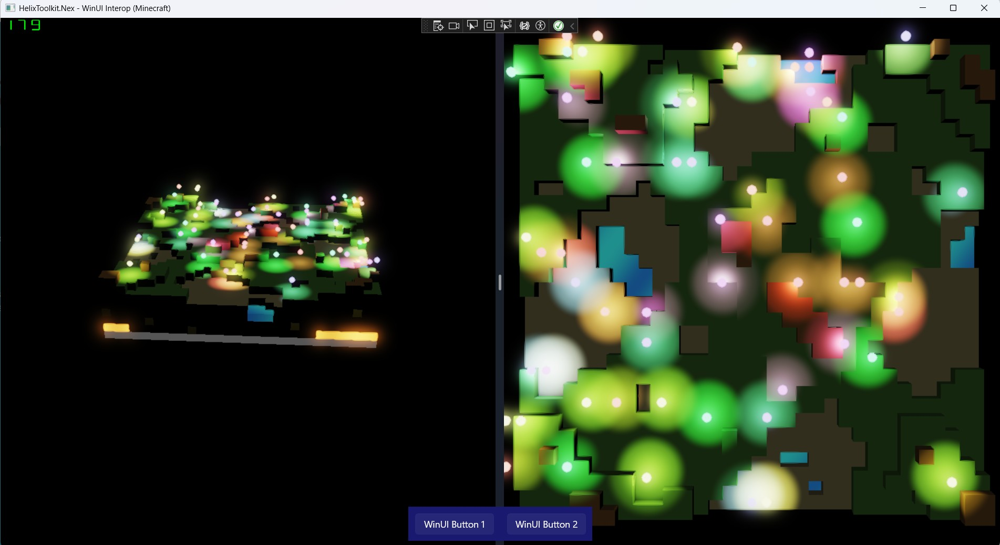
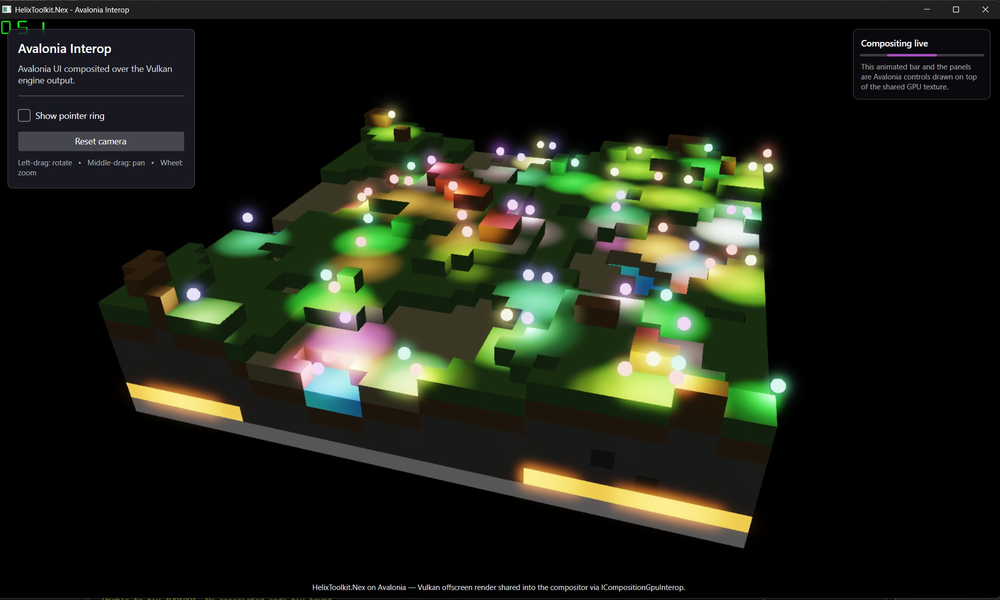

# HelixToolkit Nex 

HelixToolkit Nex is the next generation 3D graphics engine from HelixToolkit. It offers a unified graphics interface designed to support multiple backend implementations, with an initial focus on Vulkan 1.3.

The graphics interface and Vulkan backend are inspired by [LightWeightVk](https://github.com/corporateshark/lightweightvk).

Currently in development.

## Minimum Requirements
- Windows 10 or later
- Linux (Tested on Ubuntu 26.04)
- Vulkan 1.3 compatible GPU and drivers
- .NET 8.0 or later

## Features (Done or In progress)

- :white_check_mark: [Vulkan backend implementation](Source/HelixToolkit-Nex/HelixToolkit.Nex.Graphics.Vulkan/README.md)
- :white_check_mark: Complete bindless descriptor architecture.
- :white_check_mark: Support AOT compilation.
- :white_check_mark: Linux support.
- :white_check_mark: [ImGui integration](Source/HelixToolkit-Nex/Samples/GraphicsAPI/ImGuiTest/README.md)
- :white_check_mark: [Forward+(Tiled based GPU light culling)](Source/HelixToolkit-Nex/Samples/GraphicsAPI/ForwardPlusSimple/README.md) rendering pipeline.
- Material systems.
  - :white_check_mark: Physically Based Rendering
  - :white_check_mark: Point cloud
  - :white_check_mark: Billboard ([MSDF based Font support](https://github.com/chlumsky/msdfgen))
  - :white_check_mark: Material registry and shader generation system.
  - :white_check_mark: Line
  - :white_check_mark: Gizmo
  - :hourglass: Particle System (Planned)
  - :hourglass: Skeletal/Morph Target Animation (Planned)
  - :hourglass: Model importer (Planned)
    - :white_check_mark: glTF importer. [Demo](Source/HelixToolkit-Nex/Samples/Integration/gltfImporter)
- :white_check_mark: [GPU Frustum Culling](Source/HelixToolkit-Nex/Samples/GraphicsAPI/MeshCulling/README.md) and [GPU Frustum Culling on Instancing](Source/HelixToolkit-Nex/Samples/GraphicsAPI/InstancingMeshCulling/README.md). (Done)
- :white_check_mark: ECS based scene management system.
- :white_check_mark: Engine architecture design.
  - :white_check_mark: Render Graph based rendering architecture.
  - :white_check_mark: WB Order independent transparency rendering.
  - Anti-aliasing:
      - :white_check_mark: SMAA anti-aliasing.
      - :white_check_mark: FXAA anti-aliasing.
  - Effects:
    - :white_check_mark: Bloom post-processing effect.
    - :white_check_mark: Object border highlighting effect.
    - :white_check_mark: Wireframe rendering.
    - :white_check_mark: Tone mapping post-processing effect.
  - :white_check_mark: GPU picking.
  - :white_check_mark: Async Buffer/Texture upload with transfer queue.
  - :white_check_mark: Texture loading and caching system.
  - :white_check_mark: Shader compilation and management system.
 
- :white_check_mark: Wpf Framework Interoperation
- :white_check_mark: WinUI Interoperation
- :white_check_mark: Avalonia (Windows & Linux) UI Interoperation

## Rendering Samples

## Linux Support

## Interoperability

- Render content with Vulkan Backend in Wpf and WinUI applications using D3D11 interoperation. (Requires Vulkan Extension: `VK_KHR_external_memory_win32`. Only tested on Discrete Graphics Card.)

    - [WPF](Source/HelixToolkit-Nex/Samples/Interop/Wpf)

      

    - [WinUI](Source/HelixToolkit-Nex/Samples/Interop/WinUI)
  
      

    - [Avalonia](Source/HelixToolkit-Nex/Samples/Interop/Avalonia) [Supports both Windows and Linux]

      

## Packages

> **Note:** Release packages are published to GitHub Packages and NuGet.org. Nightly builds are published to GitHub Packages only.

| Project                                | GitHub                                                                                                                                                              | NuGet                                                                                                                               |
| -------------------------------------- | ------------------------------------------------------------------------------------------------------------------------------------------------------------------- | ----------------------------------------------------------------------------------------------------------------------------------- |
| HelixToolkit.Nex                       |                        |                        |
| HelixToolkit.Nex.Engine                |                 |                 |
| HelixToolkit.Nex.EntityComponentSystem |  |  |
| HelixToolkit.Nex.Geometries.Builders   |    |    |
| HelixToolkit.Nex.Geometry              |               |               |
| HelixToolkit.Nex.glTF                  |                   |                   |
| HelixToolkit.Nex.Graphics              |               |               |
| HelixToolkit.Nex.Graphics.Mock         |          |          |
| HelixToolkit.Nex.Graphics.Vulkan       |        |        |
| HelixToolkit.Nex.ImGui                 |                  |                  |
| HelixToolkit.Nex.Interop               |                |                |
| HelixToolkit.Nex.Interop.DirectX       |        |        |
| HelixToolkit.Nex.Material              |               |               |
| HelixToolkit.Nex.Maths                 |                  |                  |
| HelixToolkit.Nex.Rendering             |              |              |
| HelixToolkit.Nex.Repository            |             |             |
| HelixToolkit.Nex.Scene                 |                  |                  |
| HelixToolkit.Nex.Shaders               |                |                |
| HelixToolkit.Nex.Textures              |               |               |
| HelixToolkit.Nex.WinUI                 |                  |                  |
| HelixToolkit.Nex.Wpf                   |                    |                    |
| HelixToolkit.Nex.Avalonia              |               |               |

## Development

See the [Development Setup Guide](DEV.md) for full instructions on prerequisites, Git LFS, Git hooks, building (Windows and Linux), running tests, and formatting.

## Contributing

Interested in contributing? Please read our [Contributing Guide](CONTRIBUTING.md) for information on:
- Development setup and prerequisites
- Code formatting requirements
- Building and testing
- Submitting pull requests
