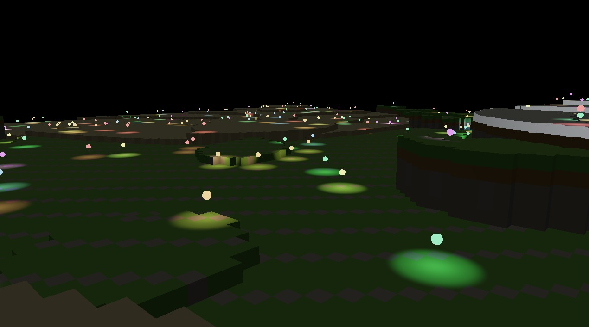

- Forward+ Tile Based Light Culling
- GPU Frustum culling
- PBR material system (Supported by material registry and shader generation system))
- Render graph based rendering architecture
- ECS based scene management system
- 

